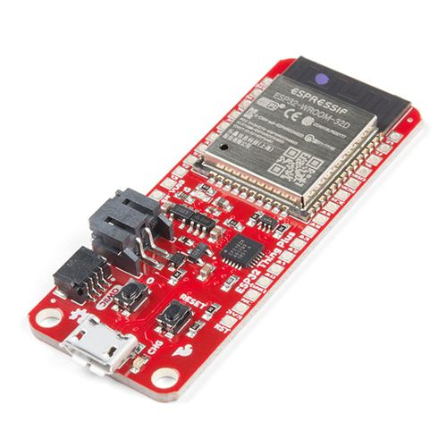
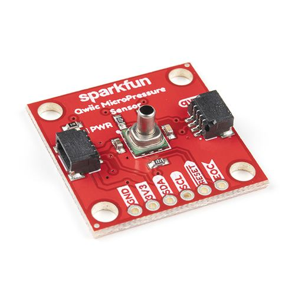
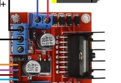
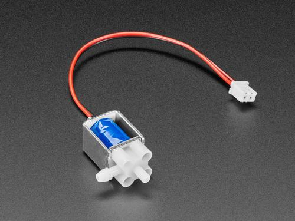

# Build Your Own Rheometer

DIY rheometer for **RheoMap**, **RheoData**, and **SlipAtlas**: off-the-shelf modules on breadboard/perfboard,
a laser-cut platform, pictographic wiring diagrams, firmware, and a step-by-step build guide.

_Custom PCB variant: [`../RheoBoard_V8_Final/`](../RheoBoard_V8_Final/)_

## Table of contents

- [Features](#features)
- [Hardware](#hardware)
- [Software configuration](#software-configuration)
- [Connect and use](#connect-and-use)
- [Step-by-step tutorial](#step-by-step-tutorial)
- [Tips](#tips)
- [Repo layout (harness)](#repo-layout-harness)

## Features

- **MCU:** SparkFun ESP32 Thing Plus (micro-USB, plain ESP32-WROOM-32D/E) — BLE to **RheoData**,
  micro-USB for both programming and power.
- **Pneumatics:** 2 air pump/vacuum motors ([Adafruit 4700](https://www.adafruit.com/product/4700)) +
  1 solenoid air valve ([Adafruit 4663](https://www.adafruit.com/product/4663)) — switched-port
  "flip" plumbing for retract/extrude REP cycles.
- **Sensing:** SparkFun Qwiic MicroPressure (Honeywell MPRLS) on the shared pneumatic line.
- **Control:** BLE OSC API (this design's firmware), SparkFun Qwiic Button (daisy-chained after
  the sensor) for onboard gestures, USB serial commands for bench debug.
- **Drivers:** 2× L298N H-bridge modules (#1 = 2 pumps, #2 = valve); one external **12 V** adapter
  powers both.

## Hardware

### Platform (laser-cut)

A single 290 × 200 mm, 3 mm acrylic panel — every component (pumps, valve, L298N drivers, ESP32,
Qwiic sensor + button) mounts to it with zip ties through cut slots, no screws or enclosure.
Design files, the component placement + zip-tie map, and cut settings are in
[`laser-cut/`](laser-cut/).

**Status:** design reference images exist (placement map + cut-geometry preview); the actual
laser-ready vector file (`.svg`/`.dxf`) and the physical cut are still TBD — see
[`laser-cut/README.md`](laser-cut/README.md) for what's there and what's missing.

### Electronics

Parts list: [`BOM.md`](BOM.md) (with component photos).

Wiring: pictographic breadboard-style diagrams in [`wiring/`](wiring/) — not abstract schematics.

This BYO track wires breakout boards instead of a custom PCB; optional custom PCB docs live in
[`../RheoBoard_V8_Final/`](../RheoBoard_V8_Final/).

**This design** — electrical wiring and pneumatic plumbing:

Text summary of the pneumatic logic: [`wiring/pneumatic-plumbing.md`](wiring/pneumatic-plumbing.md).

#### Component gallery

| | | |
|---|---|---|
|  SparkFun ESP32 Thing Plus (micro-USB) |  Qwiic MicroPressure (MPRLS) |  Qwiic Button |
|  L298N dual H-bridge (×2) |  Adafruit 4700 air pump (×2) |  Adafruit 4663 air valve |

Photo sources/licenses: [`images/components/README.md`](images/components/README.md).

## Software configuration

Firmware: [`software/rheometer-firmware/2P1VX.ino`](software/rheometer-firmware/2P1VX.ino) — the
code is unchanged, so it still advertises itself over BLE as **`2P1VX`**; look for that name when
connecting from RheoData.

1. Install [Arduino IDE](https://www.arduino.cc/en/software) 2.x and the ESP32 board package
   (Espressif `esp32` core — URL in [`software/README.md`](software/README.md)).
2. Install libraries: SparkFun Qwiic Button, SparkFun MicroPressure, OSC (Adrian Freed), and
   [**ThingPlusBLEOSC**](https://github.com/cearto/ThingPlusBLEOSC) (`git clone` into Arduino
   `libraries/` — not on Library Manager; see [`software/README.md`](software/README.md)).
3. Board: **SparkFun ESP32 Thing Plus** (or generic **ESP32 Dev Module**); port: micro-USB.
   Screenshot target: `images/ide-settings.png` (add when captured).
4. Upload — full walkthrough: [`tutorial/steps/04-install-firmware/`](tutorial/steps/04-install-firmware/).

API reference: [`software/rheometer-firmware/README.md`](software/rheometer-firmware/README.md).

## Connect and use

1. **Power:** connect the **12 V adapter** to both L298N motor rails; share GND with the ESP32. See
   [`tutorial/steps/06-power-and-connections/`](tutorial/steps/06-power-and-connections/).
2. **BLE:** pair/connect from **RheoData** — device advertises as `2P1VX`. Trigger a REP with
   OSC `rheo/rep`; tune parameters under `rheo/rep/*` (defaults documented in firmware README).
3. **USB serial (bench):** 115200 baud — `REP`, `STOP`, `PUMP1 <pct>`, `PUMP2 <pct>` when
   `SERIAL_STREAM` is enabled.
4. **Qwiic button:** 1-click = REP, 2-click = latched vacuum, hold = momentary pressure.

First successful upload should print `2P1VX initialized` on Serial Monitor.

## Step-by-step tutorial

For photo-based assembly with per-step media and videos, follow the numbered guide:

**[`tutorial/README.md`](tutorial/README.md)** → steps 01–08 in [`tutorial/steps/`](tutorial/steps/).

This is the Instructables layer on top of this README — detailed steps are split out so
photos/videos don't bloat the entry doc.

## Tips

Full context for each is in [`tutorial/README.md`](tutorial/README.md) → Tips, tagged by step.

- L298N ENA/ENB jumpers must be **removed** — the ESP32 drives those pins with PWM.
- Never route pump/valve current through the ESP32's 5 V pin — motors get their own 12 V adapter.
- Pumps are ~4.5 V parts on a 12 V rail; avoid 100% duty continuously (Adafruit rates the 4700 for
  ~50%) — tune `rheo/rep/pull/power` / `push/power` instead of running full-blast.
- Onboard button (GPIO 0), Qwiic Button, BLE (`rheo/rep`), and USB serial (`REP`) all trigger the
  same REP routine — use whichever's convenient.
- Onboard LED (GPIO 13) lights while a REP, manual blow, latched suck, or pump test is active —
  useful at-a-glance status without opening Serial Monitor.

## Repo layout (harness)

Agent/session docs — not part of the builder-facing guide:

| Path | Purpose |
|---|---|
| [`PROGRESS.md`](PROGRESS.md) | Session log |
| [`core-beliefs.md`](core-beliefs.md) | Operating principles |
| [`product-specs.md`](product-specs.md) | What we're building and why |
| [`references.md`](references.md) | Datasheets + external project links |
| [`VERIFICATION.md`](VERIFICATION.md) | Pre-release checklist (human sign-off) |
| [`images/`](images/) | Teaser, IDE screenshots, project-wide photos |

### Status

- [x] `BOM.md` populated (generic supply/tubing rows lack vendor links)
- [ ] `laser-cut/` design files complete
- [x] `wiring/` pictographic diagram(s) complete (electrical + pneumatic)
- [x] `software/` firmware present
- [x] `tutorial/steps/` written (all 8 steps; step 05 partially blocked on RheoMap's fixture spec)
- [ ] `tutorial/steps/` human-verified against a real build
- [ ] Full build passed [`VERIFICATION.md`](VERIFICATION.md)
