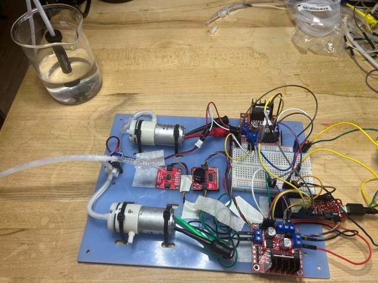

# Build Your Own Rheometer — Step-by-Step Guide

Project overview and reference material (BOM, wiring, firmware API) live in the
[repo root README](../README.md); this file is the build guide.

License: hardware CERN-OHL-W-2.0, firmware MIT, this guide CC BY-SA 4.0 — see
[repo root README](../README.md) → License, or [`../LICENSE`](../LICENSE).



## Overview

**This simple rheometer** is a benchtop pneumatic "pull-push" head: 2 air pumps + 1 valve on a
laser-cut panel, driven by an ESP32 over BLE, sensed by a Qwiic MicroPressure sensor. It runs a
**REP** (retract → extrude pulse) on command and streams a pressure trace.

~4–7 hours hands-on for a first build (mostly Step 03's soldering), plus laser-cut turnaround if
outsourced. Needs basic soldering, Arduino IDE familiarity, and reading a wiring diagram — no CAD
or custom PCB work.

## Before you start

- **Materials:** [`hardware/BOM.md`](hardware/BOM.md)
- **Design files:** [`laser-cut/`](laser-cut/) (platform), [`hardware/wiring/`](hardware/wiring/) (circuits)
- **Software:** [`software/`](software/) (flash procedure is Step 04)
- **Tools:** laser cutter or cut-to-order service (`laser-cut/panel.svg`/`.dxf` — draft, not yet
  test-fit against real parts, see [`laser-cut/README.md`](laser-cut/README.md)); zip-tie/flush
  cutters; soldering iron + solder + wire strippers + small screwdriver + multimeter; computer
  with data-capable micro-USB cable; phone/tablet or computer running **RheoData** for BLE control

## Steps

- [Step 01 — Kit contents and tools](#step-01-kit-contents-and-tools)
- [Step 02 — Assemble the platform](#step-02-assemble-the-platform) — laser-cut vector file is a draft, not yet test-fit
- [Step 03 — Wire the electronics](#step-03-wire-the-electronics)
- [Step 04 — Install firmware](#step-04-install-firmware)
- [Step 05 — Mount and set up](#step-05-mount-and-set-up) — blocked on RheoMap's fixture spec
- [Step 06 — Power and data connections](#step-06-power-and-data-connections)
- [Step 07 — Calibrate](#step-07-calibrate)
- [Step 08 — Ready to use](#step-08-ready-to-use)

---

## Step 01: Kit contents and tools

1. Unpack everything and check it against [`hardware/BOM.md`](hardware/BOM.md).
2. Note anything missing or substituted in `PROGRESS.md` — don't silently substitute.
3. Gather the tools listed above.

**Tip:** don't start wiring until the BOM is fully accounted for.

---

## Step 02: Assemble the platform

Parts: acrylic panel, ~20 zip ties, Ø10 bulkhead fitting, 4 feet — see
[`hardware/BOM.md`](hardware/BOM.md). Design file: [`laser-cut/panel.svg`](laser-cut/panel.svg)
(draft vector cut file — not yet test-fit against real parts, see
[`laser-cut/README.md`](laser-cut/README.md) before cutting).

1. Cut the panel (290 × 200 × 3 mm acrylic) per
   [`laser-cut/panel.svg`](laser-cut/panel.svg) — test-fit real components against the geometry
   first (see the status note in `laser-cut/README.md`).
2. Attach the 4 corner feet.
3. Install the Ø10 bulkhead fitting at the CHAMBER position.
4. Zip-tie each component per
   [`laser-cut/panel-placement-map.png`](laser-cut/panel-placement-map.png): PUMP1/PUMP2 lying
   flat, VALVE2 (leave VALVE1 empty), MPRLS + Button next to the ESP32, both L298N boards clear of
   their heatsinks, ESP32, power terminal block.
5. Don't wire anything yet — that's Step 03.

**Tip:** leave the VALVE1 zip-tie slot empty — reserved for a future 2-valve variant.

---

## Step 03: Wire the electronics

Parts: electronics rows in [`hardware/BOM.md`](hardware/BOM.md). Diagram:
[`hardware/wiring/wiring-diagram.png`](hardware/wiring/wiring-diagram.png) (electrical
only — pneumatic plumbing is separate, below).

1. Tie ESP32 GND, both L298N GNDs, and the 12 V adapter (−) together.
2. Solder 10 kΩ pull-downs from GPIO **14, 15, 32, 33** to GND.
3. Connect the 12 V adapter (+) to both L298N motor power inputs. Never power pumps/valve from the
   ESP32 5 V pin.
4. **L298N #1 (pumps):** remove ENA/ENB jumpers. IN1/IN3→+5V, IN2/IN4→GND. ENA→GPIO 32,
   ENB→GPIO 33. OUT1/OUT2→PUMP1, OUT3/OUT4→PUMP2.
5. **L298N #2 (valve):** same direction wiring. ENA→GPIO 14 (VALVE2). OUT1/OUT2→VALVE2.
   ENB/GPIO 15/OUT3/OUT4 unused.
6. **Qwiic chain:** ESP32 → MicroPressure (`0x18`) → Qwiic Button (`0x6F`), daisy-chained.
7. Continuity-check everything before applying 12 V.

GPIO map must match
[`software/rheometer-firmware/PneumaticSystem.h`](software/rheometer-firmware/PneumaticSystem.h).

**Pneumatic plumbing:** plumb per
[`hardware/wiring/tube-connection.png`](hardware/wiring/tube-connection.png) and
[`hardware/wiring/pneumatic-plumbing.md`](hardware/wiring/pneumatic-plumbing.md). PUMP1 port →
valve metal pole (vacuum); PUMP2 port → valve plastic pole (pressure) — motor polarity doesn't
flip air direction.

**Tip:** L298N ENA/ENB jumpers must be OFF for PWM to work.

---

## Step 04: Install firmware

Flash the BLE firmware:
[`software/rheometer-firmware/2P1VX.ino`](software/rheometer-firmware/2P1VX.ino).

1. Install [Arduino IDE](https://www.arduino.cc/en/software) 2.x.
2. Boards Manager: add the ESP32 URL from
   [`hardware/references/README.md`](hardware/references/README.md), install **esp32 by
   Espressif Systems**.
3. Library Manager: install SparkFun Qwiic Button, SparkFun MicroPressure, OSC (Adrian Freed).
4. Clone **ThingPlusBLEOSC** into Arduino `libraries/` (not on Library Manager):

   ```bash
   cd ~/Documents/Arduino/libraries
   git clone https://github.com/cearto/ThingPlusBLEOSC.git
   ```

5. Open `2P1VX.ino`, select board **SparkFun ESP32 Thing Plus** (or **ESP32 Dev Module**) and the
   micro-USB port.
6. Upload. Open Serial Monitor @ 115200 — look for `2P1VX initialized`.

**Tip:** use a data-capable micro-USB cable — charge-only cables won't show a serial port.

---

## Step 05: Mount and set up

1. Place the panel on a flat, stable, level surface.
2. Trace every pneumatic line for kinks, pinches, or tension.
3. Position the chamber/nozzle at your sample. **Exact fixture geometry is TBD** (depends on
   RheoMap's spec — see [`product-specs.md`](product-specs.md)); keep the position repeatable
   between runs for now.
4. Leave slack in the micro-USB and 12 V cables so plugging in doesn't stress the panel.
5. Keep drafts and heat sources away from the chamber — the REP's baseline phase is brief but
   sensitive to disturbance.

**Tip:** a kinked tube looks like a sensor problem — trace every line before powering on.

---

## Step 06: Power and data connections

Parts: 12 V adapter (≥ 2 A), micro-USB cable — see [`hardware/BOM.md`](hardware/BOM.md).

1. Confirm ESP32 GND, both L298N GNDs, and the 12 V adapter (−) are tied together.
2. Connect 12 V (+) to both L298N motor power inputs.
3. Power the ESP32 via micro-USB. Never back-feed 12 V into it.
4. With motors off, check for excessive current draw or heat. Then open Serial Monitor @ 115200
   and confirm MPRLS reads near ambient and the Qwiic Button responds.
5. From RheoData, connect to BLE device **`2P1VX`**.

**Tip:** 12 V is the motor supply rail — actual drive to the ~4.5 V pumps / ~6 V valve is set by
firmware PWM (`rheo/rep/pull/power`, `push/power`), not adapter voltage.

---

## Step 07: Calibrate

RheoBoard DIY uses runtime BLE parameters, not a one-shot calibration.

1. Run a few idle REPs, or wait for MPRLS to stabilize.
2. Tune `rheo/rep/baseline/time` (default 420 ms) if ambient drift is visible.
3. Tune `rheo/rep/pull/power` (54%) and `pull/time` (315 ms) for a clean retract.
4. Tune `rheo/rep/push/power`, `push/time`, `push/ramp/start`, `push/ramp/time` (defaults 100%,
   345 ms, 40%, 300 ms) for extrude.
5. Set `rheo/sense/rate` (default 10 ms) to match your capture needs.
6. Trigger `rheo/rep/triad` and confirm 3 repeatable traces.

Full parameter list:
[`software/rheometer-firmware/README.md`](software/rheometer-firmware/README.md).

**Tip:** if extrude feels too aggressive, lengthen `push/ramp/time` before shortening `push/time`.

---

## Step 08: Ready to use

Trigger a REP (retract → extrude → relax, 1500 ms total) four ways:

| Path | How |
|---|---|
| BLE | OSC `rheo/rep` |
| Onboard button | Press once (GPIO 0) |
| Qwiic Button | Single click |
| USB serial | Type `REP` |

The onboard LED (GPIO 13) lights for the duration.

**Other controls:** `rheo/rep/triad` (3 REPs back to back), `rheo/stop` / `STOP` (abort),
`rheo/purge` (clear the line), Qwiic double-click (latched vacuum), Qwiic hold (momentary blow),
`PUMP1 <pct>` / `PUMP2 <pct>` (serial bench debug), `rheo/api` (list commands). Full reference:
[`software/rheometer-firmware/README.md`](software/rheometer-firmware/README.md).

**Read a measurement:** via RheoData, connect to `2P1VX` and trigger `rheo/rep` — the pressure
trace shows in its capture view. Via serial, type `REP` and watch `#S,<ms>,<Pa>` samples between
`#REP_START`/`#REP_END`.

**Sign off:** run [`VERIFICATION.md`](VERIFICATION.md) and complete the human sign-off block.

**Tip:** the onboard button and Qwiic single-click do the exact same thing — use whichever's
within reach.

---

## Finished

_Fill in once there's a working build: final photos/video, FAQ, calibration notes._

## Tips (all steps, at a glance)

- **(01)** Check the full BOM before wiring.
- **(02)** Leave VALVE1 empty — reserved for a future 2-valve variant.
- **(03)** L298N ENA/ENB jumpers must be removed. Don't run pumps at 100% duty continuously
  (~50% max per Adafruit).
- **(04)** Use a data-capable micro-USB cable.
- **(04)/(06)** MPRLS/Button issues are usually a Qwiic cable/order problem, not the part itself.
- **(06)** Never power motors from the ESP32 5 V pin.
- **(07)** Lengthen `push/ramp/time` before shortening `push/time` if extrude feels aggressive.
- **(08)** Onboard button, Qwiic Button, BLE, and serial all trigger the same REP — use
  whichever's convenient.

## Media conventions

Photos go in [`images/`](images/), named by step (e.g. `step02-panel-placement.jpg`). Prefer
hosting video externally (e.g. unlisted YouTube) and linking it, rather than committing large
files to git.
