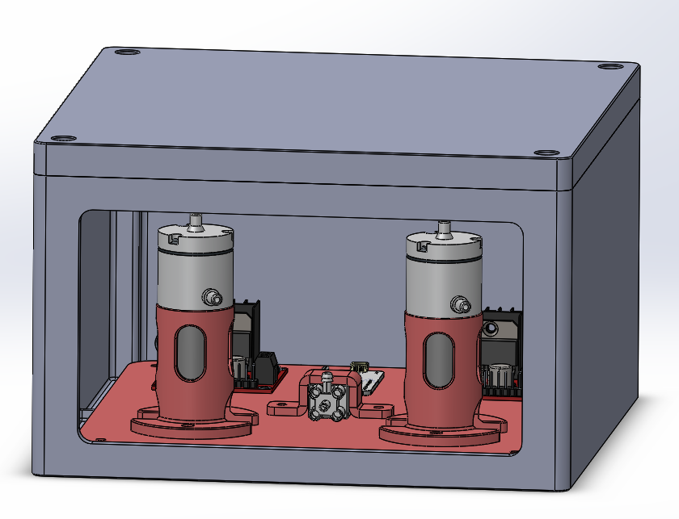
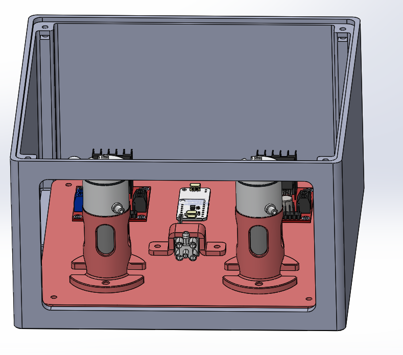

# 3D-printed panel and enclosure

License: hardware CERN-OHL-W-2.0 — see [`../../../LICENSE`](../../../LICENSE).

Version 2 of RheoBoard mounts the pumps, valve, and electronics on a 3D-printed panel inside a
3D-printed enclosure. There are no laser-cut parts. The version 1 laser-cut panel is archived in
[`../../archive/laser-cut-v1/`](../../archive/laser-cut-v1/).

## Files

`Concept_v2.STEP` is the full assembly, including the purchased components. The printable parts
are in [`part/`](part/). Sizes below are approximate, measured from the STEP geometry.

| File | Approx. size (mm) | Likely role |
|---|---|---|
| [`part/part_01_holes_4mm.STEP`](part/part_01_holes_4mm.STEP) | 170 × 170 × 4 | Base panel, with 4 mm holes |
| [`part/part_2.STEP`](part/part_2.STEP) | 42.5 × 45 × 81 | Pump holder (the renders show two) |
| [`part/part_03.STEP`](part/part_03.STEP) | 45 × 12 × 15 | Small bracket, likely for the valve |
| [`part/part_04.STEP`](part/part_04.STEP) | about 195 wide | Enclosure body |
| [`part/part_05.STEP`](part/part_05.STEP) | 195 × 195 × 29 | Lid |

TODO: confirm each part's role and the number of copies to print.

## Printing

- Material: PLA.
- Printer and settings: a Bambu Lab printer with the normal (default) PLA profile.
- Bambu Studio opens STEP files directly; there are no STL or slicer project files yet.

TODO: print orientation, supports, and any non-default settings per part.

The sensing tube and small connector are printed from [`../connector/`](../connector/), in Step 01 of the [build guide](../../README.md#step-01-assemble-the-platform).

## Assembly

TODO: how the components fasten to the panel (screw size and count for the 4 mm holes), how the
panel mounts in the enclosure, how the lid attaches, and where the MPRLS, seesaw, ESP32, and
Button sit. The renders above show the two pumps upright in printed holders with the valve
between them and the L298N drivers behind the pumps.

The editable CAD project that produced these STEP files is not in this repository yet.
