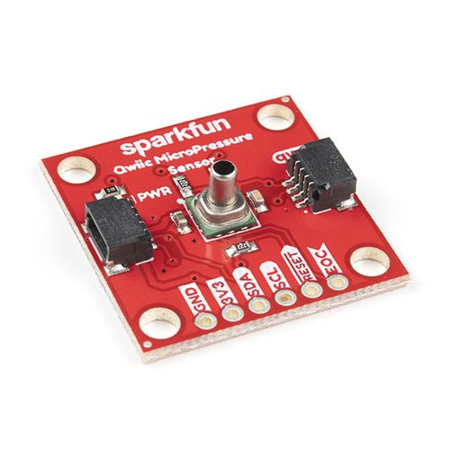
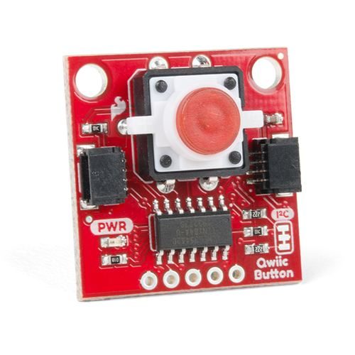
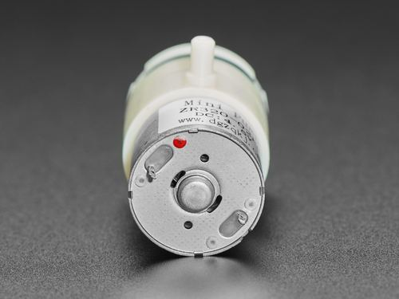

# Bill of Materials — Build Your Own

Parts list for the **2 pumps + 1 valve** DIY bench rig. Wiring:
[`wiring/2P1V-wiring-diagram.png`](wiring/2P1V-wiring-diagram.png). Firmware:
[`../software/rheometer-firmware/`](../software/rheometer-firmware/). Component photo sources/licenses:
[`images/README.md`](images/README.md).

License: CERN-OHL-W-2.0 — see [`../../LICENSE-HARDWARE.txt`](../../LICENSE-HARDWARE.txt). Current
hardware revision: see [`REVISIONS.md`](REVISIONS.md).

| Photo | Part | Qty | Source/link | Datasheet | Notes |
|---|---|---|---|---|---|
|  | SparkFun ESP32 Thing Plus (micro-USB, WRL-15663) | 1 | https://www.sparkfun.com/sparkfun-esp32-thing-plus.html | [`references/datasheets/ESP32_Thing_Plus_Schematic.pdf`](references/datasheets/ESP32_Thing_Plus_Schematic.pdf), [`ESP32_Thing_Plus_Graphical_Datasheet.pdf`](references/datasheets/ESP32_Thing_Plus_Graphical_Datasheet.pdf) | MCU; plain ESP32-WROOM-32D/E (not S2/S3); powers + programs over micro-USB; Qwiic port for sensor chain |
|  | SparkFun Qwiic MicroPressure (MPRLS) | 1 | https://www.sparkfun.com/sparkfun-qwiic-micropressure-sensor.html | [`references/datasheets/Honeywell_MPR_Series_Datasheet.pdf`](references/datasheets/Honeywell_MPR_Series_Datasheet.pdf) | Honeywell MPR series; I2C `0x18`; first Qwiic device in the chain |
|  | SparkFun Qwiic Button, red (BOB-15932) | 1 | https://www.sparkfun.com/sparkfun-qwiic-button.html | [`references/datasheets/Qwiic_Button_Schematic.pdf`](references/datasheets/Qwiic_Button_Schematic.pdf) | I2C, default address `0x6F`; 1-click=REP, hold=momentary pressure; daisy-chained after the MicroPressure sensor on the same Qwiic bus |
|  | L298N dual H-bridge module | 2 | https://www.amazon.com/s?k=L298N+motor+driver | https://www.st.com/resource/en/datasheet/l298.pdf | #1 = 2 pumps; #2 = valve; ENA/ENB jumpers **OFF** |
|  | Air pump / vacuum motor (Adafruit 4700, ZR320-02PM) | 2 | https://www.adafruit.com/product/4700 | [`references/datasheets/ZR320-02PM_4.5V.pdf`](references/datasheets/ZR320-02PM_4.5V.pdf) | ~4.5 V / ~600 mA each; PUMP1 = vacuum (retract), PUMP2 = pressure (extrude); **flow direction is fixed by port plumbing, not motor polarity** |
|  | 6 V air valve (Adafruit 4663, FA0520E) | 1 | https://www.adafruit.com/product/4663 | [`references/datasheets/4663_C14660_DC_6V.pdf`](references/datasheets/4663_C14660_DC_6V.pdf) | 3-port flip selector (VALVE2); metal pole = vacuum path, plastic pole = pressure path |
| — | Resistor 10 kΩ | 4 | — | — | Pull-down on GPIO 14, 15, 32, 33 to GND |
| — | DC power adapter 12 V | 1 | — | — | External supply for both L298N motor rails; ≥ 2 A recommended; share GND with ESP32 |
| — | Silicone tubing 3 mm ID | 1 | https://www.adafruit.com/product/4664 | — | Pneumatic plumbing; see `wiring/pneumatic-plumbing.md` |
| — | Qwiic cables (×2) | 2 | https://www.sparkfun.com/cables.html | — | ESP32 → MicroPressure → Button (daisy-chained on one I2C bus) |
| — | micro-USB cable | 1 | — | — | Flash `2P1VX.ino`; also powers the ESP32 during upload/bench use |
| — | Acrylic panel, laser-cut (290 × 200 × 3 mm) | 1 | — | — | Mounting platform for every component; see [`../laser-cut/`](../laser-cut/) for cut file + placement map (draft vector file, not yet test-fit — see status there) |
| — | Zip ties, small (~2.5 mm wide) | ~20 | — | — | Every component is zip-tied to the panel, not screwed; see [`../laser-cut/README.md`](../laser-cut/README.md) for tie counts per part |
| — | Ø10 panel-mount bulkhead fitting | 1 | — | — | Chamber/nozzle mount point on the panel; pairs with the 3 mm ID tubing above |
| — | Rubber/plastic feet | 4 | — | — | Panel corner feet |

## Notes

- Pumps are rated ~4.5–5 V; valve ~6 V. The rig runs from a **12 V adapter** into the L298N motor
  inputs and uses **PWM** (`rheo/rep/*` power levels) to limit effective drive — tune defaults in
  RheoData rather than running channels at 100% duty continuously. Adafruit rates the 4700 for ~50%
  duty cycle.
- The L298N photo is a generic-module stand-in (no single canonical vendor page) — see
  [`images/README.md`](images/README.md) for its source/license. Swap it for
  a photo of your exact board if it looks different.
- When swapping a part, update this table, `wiring/` diagrams, and
  `../software/rheometer-firmware/PneumaticSystem.h`
  GPIO defines together.
- Record any substitution in `references/README.md` and `PROGRESS.md`.
