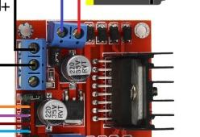
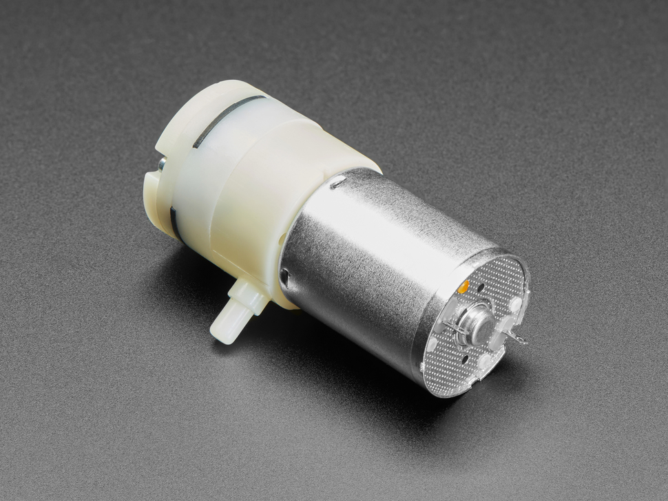
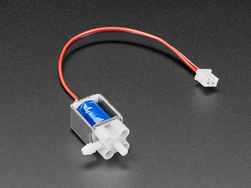

# Hardware and bill of materials

Parts list for the **2 pumps + 1 valve** DIY bench rig. Wiring:
[`electronic-wiring/wiring-diagram.png`](electronic-wiring/wiring-diagram.png) and
[`tube-wiring/`](tube-wiring/). Firmware:
[`../../firmware/`](../../firmware/) (shared by the DIY build, the PCB, and the portable version).
RheoData notes: [`../../software/`](../../software/). Component photo sources/licenses:
[`../images/README.md`](../images/README.md).

License: CERN-OHL-W-2.0 — see [`../../LICENSE`](../../LICENSE).

This is the one parts list for the build. Tools are listed in
[`../../docs/assembly-tools.md`](../../docs/assembly-tools.md). A TODO row names a part the build
uses whose exact type, size, or quantity is not documented yet.

## Parts to buy

| Photo | Part | Qty | Source/link | Datasheet | Notes |
|---|---|---|---|---|---|
|  | SparkFun ESP32 Thing Plus (micro-USB, WRL-15663) | 1 | https://www.sparkfun.com/sparkfun-esp32-thing-plus.html | [`references/datasheets/ESP32_Thing_Plus_Schematic.pdf`](references/datasheets/ESP32_Thing_Plus_Schematic.pdf), [`ESP32_Thing_Plus_Graphical_Datasheet.pdf`](references/datasheets/ESP32_Thing_Plus_Graphical_Datasheet.pdf) | MCU; plain ESP32-WROOM-32D/E (not S2/S3); USB uploads firmware; after upload, USB may be disconnected; Qwiic port for sensor chain |
|  | SparkFun Qwiic MicroPressure (MPRLS) | 1 | https://www.sparkfun.com/sparkfun-qwiic-micropressure-sensor.html | [`references/datasheets/Honeywell_MPR_Series_Datasheet.pdf`](references/datasheets/Honeywell_MPR_Series_Datasheet.pdf) | I2C `0x18`; Qwiic |
|  | SparkFun Qwiic Button, red (BOB-15932) | 1 | https://www.sparkfun.com/sparkfun-qwiic-button.html | [`references/datasheets/Qwiic_Button_Schematic.pdf`](references/datasheets/Qwiic_Button_Schematic.pdf) | I2C `0x6F`; Qwiic |
|  | Adafruit ATtiny1616 Breakout with seesaw, STEMMA QT/Qwiic (PID 5690) | 1 | https://www.adafruit.com/product/5690 | [Adafruit seesaw guide](https://learn.adafruit.com/adafruit-attiny817-seesaw) | I2C `0x49`; 3.3 V Qwiic logic; PWM/GPIO output |
|  | L298N dual H-bridge module | 2 | https://www.amazon.com/s?k=L298N+motor+driver | https://www.st.com/resource/en/datasheet/l298.pdf | #1 drives two pumps; #2 drives one valve |
|  | Air pump / vacuum motor (Adafruit 4699, ZR370-02PM) | 2 | https://www.adafruit.com/product/4699 | [`references/datasheets/ZR370-02PM_4.5V.pdf`](references/datasheets/ZR370-02PM_4.5V.pdf) | ~4.5 V / ~500 mA each; 2.5 LPM; 58.2 × Ø27.0 mm nominal |
|  | 6 V air valve (Adafruit 4663, FA0520E) | 1 | https://www.adafruit.com/product/4663 | [`references/datasheets/4663_C14660_DC_6V.pdf`](references/datasheets/4663_C14660_DC_6V.pdf) | 3-port flip selector |
| — | DC power adapter 12 V | 1 | — | — | Everyday wall power for this DIY build and for the PCB. On this build, external supply for both L298N motor rails; ≥ 2 A recommended; share GND with ESP32. Pump and valve current does not go through the ESP32 5 V pin. |
| — | Single-cell LiPo | 1 | — | [`references/datasheets/ESP32_Thing_Plus_Schematic.pdf`](references/datasheets/ESP32_Thing_Plus_Schematic.pdf), [`ESP32_Thing_Plus_Graphical_Datasheet.pdf`](references/datasheets/ESP32_Thing_Plus_Graphical_Datasheet.pdf) | Portable power for the ESP32 Thing Plus. Graphical datasheet: JST connector for a single-cell LiPo; VBAT direct to the battery and the charger. Schematic: V_BATT, single cell, 4.2 V maximum. No battery part number is specified. TODO: the maintainer said 3–5 V; the datasheet maximum is 4.2 V. Confirm. |
| — | Silicone tubing, Adafruit 4661 | 1 | https://www.adafruit.com/product/4661 | — | 1 m, 3 mm ID, 5 mm OD, for air only. See `tube-wiring/README.md`. TODO: length of each run. |
| — | Qwiic cables | 3 | https://www.sparkfun.com/cables.html | — | Four Qwiic boards daisy-chained on one I2C bus |
| — | micro-USB cable | 1 | — | — | Flash `2P1V_Adafruit.ino`; also powers the ESP32 during upload/bench use |
| — | Value Plastics FTLLB220-6005 female luer-thread panel-mount fitting | 1 | — | — | Named in [`../cad/connector/README.md`](../cad/connector/README.md). The sensing tube's luer is intended to mate with it. TODO: where to buy it. |
| — | Tee | TODO | — | — | TODO: the part that tees the pressure sensor into the shared line. [`tube-wiring/README.md`](tube-wiring/README.md) says the sensor is "Teed into shared line". |
| — | Hookup wire | TODO | — | — | TODO: type and gauge. [`electronic-wiring/README.md`](electronic-wiring/README.md) uses discrete point-to-point wires for the seesaw-to-L298N signals. |
| — | 4 mm zip ties | TODO | — | — | Fasteners for the enclosure. A count is not stated. Board positions on the enclosure stay TODO until the enclosure CAD is updated. Files stay in [`../cad/encloser/`](../cad/encloser/). |

## Parts to 3D print

| Photo | Part | Qty | Source/link | Datasheet | Notes |
|---|---|---|---|---|---|
| — | 3D-printed panel, pump holders, bracket, enclosure body, and lid (PLA) | 1 set | — | — | See [`../cad/encloser/`](../cad/encloser/); Bambu Lab printer, normal PLA profile. TODO: number of copies of each part. |
| — | Printed sensing tube (`sensing_tube.stl`) | TODO | — | — | [`../cad/connector/sensing_tube.stl`](../cad/connector/sensing_tube.stl); about 12 mm diameter × 113.2 mm tall; male luer-lock. Import at 100% scale. |
| — | Printed small connector (`connector_small.stl`) | TODO | — | — | [`../cad/connector/connector_small.stl`](../cad/connector/connector_small.stl); about 6.35 × 7.33 × 15.54 mm. Import at 100% scale. |
| — | 3D-printed GL45 two-port cap | TODO | — | — | Probe part. Print file is not in this repository yet. TODO. This is not `sensing_tube.stl` or `connector_small.stl`. |
| — | 3D-printed tube that fits GL45 | TODO | — | — | Probe part, used with the Adafruit 4661 tube and the GL45 two-port cap. Print file is not in this repository yet. TODO. This is not `sensing_tube.stl` or `connector_small.stl`. |

## Notes

- Sample container: a GL45 lab reagent bottle is recommended. A beaker, cup, or any other fluid
  container is also fine.
- Between samples, clean the tube. TODO: how.
- Pumps are rated ~4.5–5 V and the valve ~6 V. Adafruit's ~50% pump duty-cycle recommendation
  describes intermittent run time, not a 50% PWM ceiling; firmware may use brief higher-PWM pulses,
  but the pumps should not run continuously.
- The L298N photo is a generic-module stand-in (no single canonical vendor page) — see
  [`../images/README.md`](../images/README.md) for its source/license. Swap it for
  a photo of your exact board if it looks different.
- Before substituting a part, confirm its electrical, pneumatic, mechanical, and firmware
  compatibility against the linked folder documentation.
