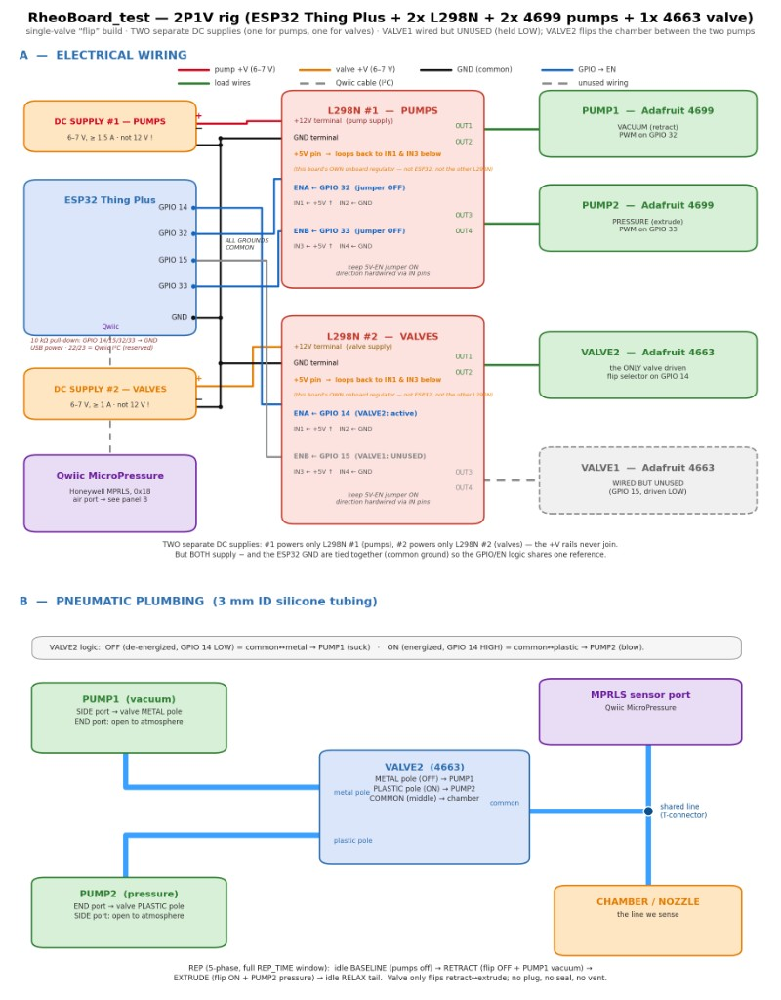
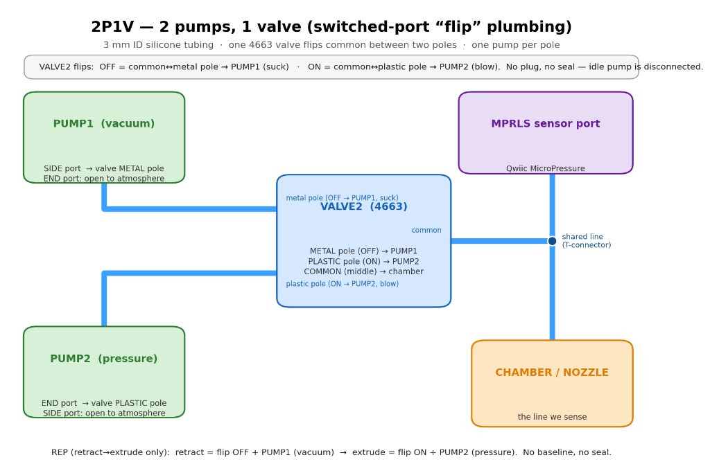

# Circuit / wiring diagrams

**2P1V rig** — 2 pumps, 1 valve (switched-port "flip" plumbing). Firmware:
[`../software/2P1VX/`](../software/2P1VX/) (`2P1VX.ino`).

## Electrical wiring

Summary (see diagram for full detail):

- **MCU:** SparkFun ESP32 Thing Plus — GPIO 32/33 → L298N #1 (pumps), GPIO 14/15 → L298N #2
  (valves), Qwiic → MPRLS pressure sensor (I2C `0x18`).
- **10 kΩ pull-downs** on GPIO 14, 15, 32, 33 to GND.
- **L298N #1 (pumps):** ENA/ENB jumpers OFF; IN1/IN3 looped to +5V, IN2/IN4 to GND (direction
  hardwired). OUT1/2 → PUMP1 (vacuum), OUT3/4 → PUMP2 (pressure).
- **L298N #2 (valve):** same direction wiring. ENA→GPIO 14 (VALVE2). OUT1/OUT2→VALVE2. GPIO 15 /
  ENB / OUT3/OUT4 may be left unwired in minimal 2P1V builds.
- **Power:** external **12 V DC adapter** (≥ 2 A recommended) to both L298N motor power inputs;
  common GND with ESP32. PWM on ENA/ENB limits effective voltage to pumps (~4.5 V rated) and valve
  (~6 V rated) — see [`../BOM.md`](../BOM.md) notes.

GPIO map matches `PneumaticSystem.h` in firmware: `PIN_PUMP1_EN=32`, `PIN_PUMP2_EN=33`,
`PIN_VALVE2_EN=14`, `PIN_VALVE1_EN=15`.

## Pneumatic plumbing

See also [`pneumatic-plumbing.md`](pneumatic-plumbing.md) for text summary and REP cycle.

- **Tubing:** 3 mm ID silicone throughout.
- **VALVE2 (4663)** flips common between PUMP1 (vacuum, metal pole) and PUMP2 (pressure, plastic
  pole).
- **MPRLS** tees into the shared line to chamber/nozzle.

## Conventions

- Prefer pictographic diagrams (like the images above) over abstract schematics for builders.
- When updating wiring, update the image **and** the GPIO defines in `software/2P1VX/PneumaticSystem.h`
  together — keep them in sync.
- A photo of the finished build from the same angle as the diagram is a useful supplement.
