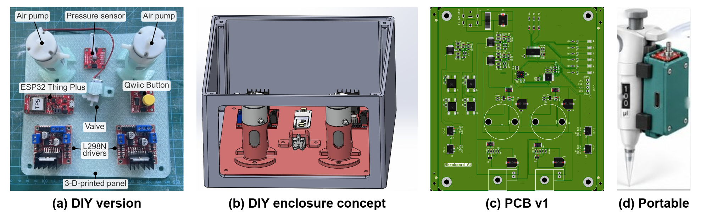

# RheoBoard

RheoBoard is open hardware for pneumatic retraction-extrusion measurements. On command, it runs a REP (retraction-extrusion pulse) and streams the pressure trace.

## Start here

[Wiki Page](https://github.com/The-Hybrid-Atelier/RheoBoard/wiki)

## License

All license notices are consolidated in [`LICENSE`](LICENSE):

- Hardware designs: CERN-OHL-W-2.0
- Firmware: MIT
- Documentation: [CC BY-SA 4.0](https://creativecommons.org/licenses/by-sa/4.0/)

RheoBoard is certified open source hardware by the Open Source Hardware Association,
UID [US002865](https://certification.oshwa.org/us002865.html); details are on the
[Certification](https://github.com/The-Hybrid-Atelier/RheoBoard/wiki/Certification) page.
Machine-readable project metadata and the current version are in
[`okh-RheoBoard.yml`](okh-RheoBoard.yml).

## Disclaimer

If you build or distribute a derived unit, do not imply that it is manufactured, sold, warranted,
or endorsed by the original designer.

## Author

Created and maintained by Charlie Vuong (The Hybrid Atelier at UT Arlington).
