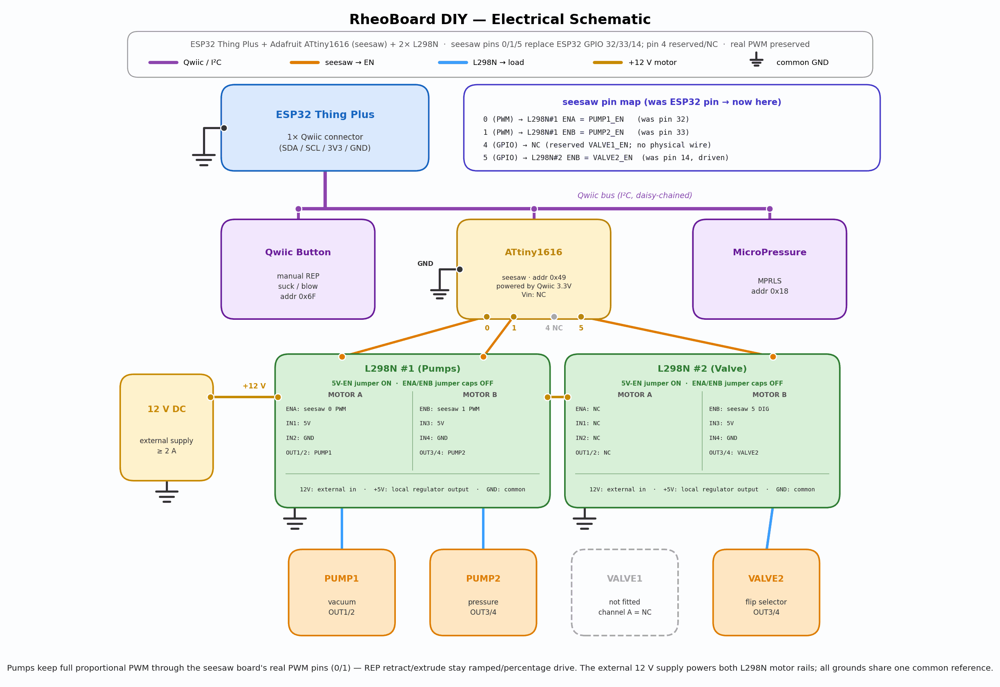
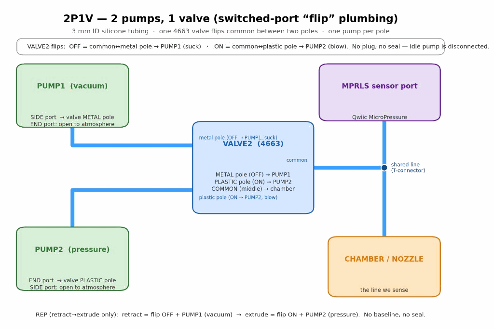
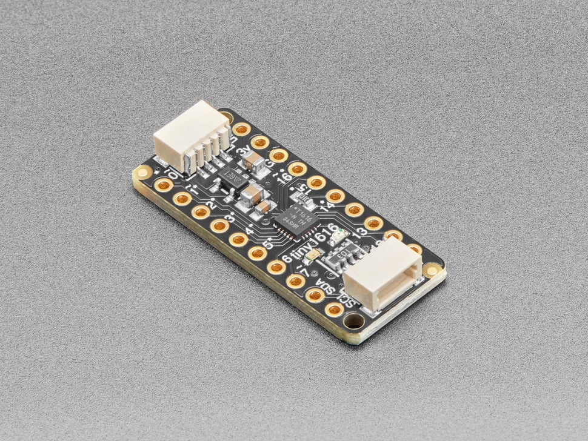

# RheoBoard

### A low-cost, DIY benchtop pneumatic rheometer head for the RheoMap, RheoData, and SlipAtlas projects

Maintained by Charlie Vuong (The Hybrid Atelier).

This project is open hardware. The hardware design is licensed under the
[CERN Open Hardware Licence — Weakly Reciprocal](LICENSE), the firmware under the
[MIT License](BuildYourOwn/software/rheometer-firmware/LICENSE), and the documentation under
[CC BY-SA 4.0](https://creativecommons.org/licenses/by-sa/4.0/) — see [License](#license) for the
full breakdown, or the machine-readable manifest [`okh-RheoBoard.yml`](okh-RheoBoard.yml).


A benchtop pneumatic "pull-push" head: 2 air pumps + 1 valve on a laser-cut panel, driven by an
ESP32 over BLE and sensed by a Qwiic MicroPressure sensor, built from off-the-shelf modules for
well under the cost of a commercial instrument. There are two ways to build the hardware:

1. **Build Your Own** ([`BuildYourOwn/`](BuildYourOwn/)) — off-the-shelf modules/dev boards,
   breadboard/perfboard, wiring diagrams + BOM + assembly guide. **Current focus.**
2. **Custom PCB** ([`RheoBoard_V8_Final/`](RheoBoard_V8_Final/)) — Altium-designed board.

> Full project background, goals, and specs are being written up in
> `BuildYourOwn/product-specs.md` — this README will grow as that lands.

- [A step-by-step build guide](BuildYourOwn/README.md)
- [A full bill of materials, with photos](BuildYourOwn/hardware/BOM.md)
- [Editable wiring-diagram and laser-cut design sources](#repository-layout), not just rendered images
- [A build-verification checklist](BuildYourOwn/VERIFICATION.md)
- [Firmware and OSC control API](BuildYourOwn/software/rheometer-firmware/README.md)

## Start here

Want to actually build one? Skip straight to the numbered, step-by-step guide:
**[`BuildYourOwn/README.md`](BuildYourOwn/README.md)**. Everything below is reference material
that guide links out to as it goes.

## Table of contents

- [Features](#features)
- [Hardware](#hardware)
- [Software configuration](#software-configuration)
- [Connect and use](#connect-and-use)
- [Tips](#tips)
- [Repository layout](#repository-layout)
- [Status](#status)
- [License](#license)

## Features

- **MCU:** SparkFun ESP32 Thing Plus (micro-USB, plain ESP32-WROOM-32D/E) — BLE to **RheoData**,
  micro-USB for both programming and power.
- **Pneumatics:** 2 air pump/vacuum motors ([Adafruit 4700](https://www.adafruit.com/product/4700)) +
  1 solenoid air valve ([Adafruit 4663](https://www.adafruit.com/product/4663)) — switched-port
  "flip" plumbing for retract/extrude REP cycles.
- **Sensing:** SparkFun Qwiic MicroPressure (Honeywell MPRLS) on the shared pneumatic line.
- **Control:** BLE OSC API (this design's firmware), SparkFun Qwiic Button (daisy-chained on the
  same Qwiic bus) for onboard gestures, USB serial commands for bench debug.
- **Drivers:** 2× L298N H-bridge modules (#1 = 2 pumps, #2 = valve); one external **12 V** adapter
  powers both. `ENA`/`ENB` control lines are driven by an
  [Adafruit ATtiny1616 Breakout with seesaw](https://www.adafruit.com/product/5690) on the Qwiic
  bus (real PWM over I2C), not native ESP32 GPIO pins.

## Hardware

### Platform (laser-cut)

A single 290 × 200 mm, 3 mm acrylic panel — every component (pumps, valve, L298N drivers, ESP32,
Qwiic sensor + button) mounts to it with zip ties through cut slots, no screws or enclosure.
Design files, the component placement + zip-tie map, and cut settings are in
[`BuildYourOwn/laser-cut/`](BuildYourOwn/laser-cut/).

**Status:** a draft vector cut file (`panel.svg`/`panel.dxf`, traced from the raster reference)
exists but hasn't been verified against real parts, and the physical cut hasn't happened — see
[`BuildYourOwn/laser-cut/README.md`](BuildYourOwn/laser-cut/README.md) for what's there and what's
missing.

### Electronics

Everything electrical — parts list, wiring diagrams, component photos, and datasheets — lives in
[`BuildYourOwn/hardware/`](BuildYourOwn/hardware/).

Parts list: [`BuildYourOwn/hardware/BOM.md`](BuildYourOwn/hardware/BOM.md) (with component photos).

Wiring: pictographic breadboard-style diagrams in
[`BuildYourOwn/hardware/wiring/`](BuildYourOwn/hardware/wiring/) — not abstract schematics.

This DIY track wires breakout boards instead of a custom PCB; optional custom PCB docs live in
[`RheoBoard_V8_Final/`](RheoBoard_V8_Final/).

**This design** — electrical wiring and pneumatic plumbing:

<a href="BuildYourOwn/hardware/wiring/wiring-diagram.png"></a>

<a href="BuildYourOwn/hardware/wiring/tube-connection.png"></a>

Text summary of the pneumatic logic:
[`BuildYourOwn/hardware/wiring/pneumatic-plumbing.md`](BuildYourOwn/hardware/wiring/pneumatic-plumbing.md).

#### Component gallery

| | | |
|---|---|---|
| <br>SparkFun ESP32 Thing Plus (micro-USB) | <br>Qwiic MicroPressure (MPRLS) | <br>Qwiic Button |
| <br>Adafruit ATtiny1616 seesaw breakout | <br>L298N dual H-bridge (×2) | <br>Adafruit 4700 air pump (×2) |
| <br>Adafruit 4663 air valve | | |

Photo sources/licenses:
[`BuildYourOwn/hardware/images/README.md`](BuildYourOwn/hardware/images/README.md).

## Software configuration

Firmware: [`BuildYourOwn/software/rheometer-firmware/2P1V_Adafruit.ino`](BuildYourOwn/software/rheometer-firmware/2P1V_Adafruit.ino)
— advertises itself over BLE as **`2P1V_Adafruit`**; look for that name when connecting from
RheoData.

1. Install [Arduino IDE](https://www.arduino.cc/en/software) 2.x and the ESP32 board package
   (Espressif `esp32` core — URL in [`BuildYourOwn/software/README.md`](BuildYourOwn/software/README.md)).
2. Install libraries: SparkFun Qwiic Button, SparkFun MicroPressure, **Adafruit seesaw Library**,
   OSC (Adrian Freed), and [**ThingPlusBLEOSC**](https://github.com/cearto/ThingPlusBLEOSC)
   (`git clone` into Arduino `libraries/` — not on Library Manager; see
   [`BuildYourOwn/software/README.md`](BuildYourOwn/software/README.md)).
3. Board: **SparkFun ESP32 Thing Plus** (or generic **ESP32 Dev Module**); port: micro-USB.
   Screenshot target: `BuildYourOwn/images/ide-settings.png` (add when captured).
4. Upload — full walkthrough: [`BuildYourOwn/README.md`](BuildYourOwn/README.md) → Step 04.

API reference: [`BuildYourOwn/software/rheometer-firmware/README.md`](BuildYourOwn/software/rheometer-firmware/README.md).

## Connect and use

1. **Power:** connect the **12 V adapter** to both L298N motor rails; share GND with the ESP32.
   See [`BuildYourOwn/README.md`](BuildYourOwn/README.md) → Step 06.
2. **BLE:** pair/connect from **RheoData** — device advertises as `2P1V_Adafruit`. Trigger a REP
   with OSC `rheo/rep`; tune parameters under `rheo/rep/*` (defaults documented in firmware README).
3. **USB serial (bench):** 115200 baud — `REP`, `STOP`, `PUMP1 <pct>`, `PUMP2 <pct>` when
   `SERIAL_STREAM` is enabled.
4. **Qwiic button:** 1-click = REP, 2-click = latched vacuum, hold = momentary pressure.

First successful upload should print `2P1V_Adafruit initialized` on Serial Monitor.

## Tips

Full context for each is in [`BuildYourOwn/README.md`](BuildYourOwn/README.md) → Tips, tagged by
step.

- L298N ENA/ENB jumpers must be **removed** — the Adafruit ATtiny1616 seesaw breakout drives those
  pins with PWM (over Qwiic/I2C, not native ESP32 GPIO).
- Never route pump/valve current through the ESP32's 5 V pin — motors get their own 12 V adapter.
- Pumps are ~4.5 V parts on a 12 V rail; avoid 100% duty continuously (Adafruit rates the 4700 for
  ~50%) — tune `rheo/rep/pull/power` / `push/power` instead of running full-blast.
- Onboard button (GPIO 0), Qwiic Button, BLE (`rheo/rep`), and USB serial (`REP`) all trigger the
  same REP routine — use whichever's convenient.
- Onboard LED (GPIO 13) lights while a REP, manual blow, latched suck, or pump test is active —
  useful at-a-glance status without opening Serial Monitor.

## Repository layout

```
├── BuildYourOwn/              The DIY build (current focus) + project docs
│   ├── README.md              - Step-by-step build guide (8 steps, single file)
│   ├── hardware/              - Everything electrical
│   │   ├── BOM.md             - Bill of materials (with component photos)
│   │   ├── wiring/            - Electrical schematic + pneumatic diagrams (+ generator script)
│   │   ├── images/            - Component photos
│   │   ├── references/        - Vendored datasheets
│   │   └── REVISIONS.md       - Hardware revision history (unit ↔ design-file mapping)
│   ├── laser-cut/             - Mounting-panel design files (vector source + placement map)
│   ├── software/              - ESP32 firmware + IDE setup
│   ├── images/                - Project-wide photos (teaser, etc.)
│   ├── VERIFICATION.md        - Build verification + OSHWA-readiness checklist
│   └── PROGRESS.md, core-beliefs.md, product-specs.md   - Project docs
├── RheoBoard_V8_Final/        Custom PCB (Altium: schematic, layout, libraries, BOM, outputs)
├── okh-RheoBoard.yml          Open Know-How manifest (machine-readable open-hardware metadata)
├── LICENSE                    Hardware license, full text (CERN-OHL-W-2.0) — also the repo's
│                              GitHub-detected license; software/documentation licenses are
│                              declared in the License section below (firmware also carries its
│                              own copy: `software/rheometer-firmware/LICENSE`)
└── AGENTS.md                  Map for AI coding agents working in this repo
```

## Status

- [x] `BuildYourOwn/hardware/BOM.md` populated (generic supply/tubing rows lack vendor links)
- [ ] `BuildYourOwn/laser-cut/` design files complete
- [x] `BuildYourOwn/hardware/wiring/` pictographic diagram(s) complete (electrical + pneumatic)
- [x] `BuildYourOwn/software/` firmware present
- [x] `BuildYourOwn/README.md` step-by-step guide written (all 8 steps; Step 05 partially blocked
      on RheoMap's fixture spec)
- [ ] Step-by-step guide human-verified against a real build
- [ ] Full build passed [`BuildYourOwn/VERIFICATION.md`](BuildYourOwn/VERIFICATION.md)

Actively developed, solo maintainer. See [`BuildYourOwn/PROGRESS.md`](BuildYourOwn/PROGRESS.md)
for the latest state.

## License

RheoBoard uses three separate licenses — one per category of content, as recommended by
[OSHWA](https://certification.oshwa.org/)'s open hardware certification guidance. Each is a
standard, unmodified license text — no repo-specific copy needed beyond where noted:

| Content | License | Text |
|---|---|---|
| Hardware — wiring diagrams, laser-cut design, BOM, PCB design | [CERN-OHL-W-2.0](https://ohwr.org/cern_ohl_w_v2.txt) | [`LICENSE`](LICENSE) (repo root) |
| Software — firmware (`BuildYourOwn/software/rheometer-firmware/`) | MIT | [`BuildYourOwn/software/rheometer-firmware/LICENSE`](BuildYourOwn/software/rheometer-firmware/LICENSE) |
| Documentation — READMEs, build guide, BOM/wiring write-ups | [CC BY-SA 4.0](https://creativecommons.org/licenses/by-sa/4.0/) | linked above, no local copy (standard practice for CC licenses) |

CERN-OHL-W is "weakly reciprocal": anyone who modifies the hardware design must share those
modifications back under the same license, but a larger project that merely incorporates this
hardware doesn't have to be open itself. Third-party components (ESP32, L298N, pumps, valve,
sensor, Qwiic modules) and third-party libraries (ThingPlusBLEOSC, OSC, ESP32 BLE Arduino, etc.)
remain under their own licenses — see
[`BuildYourOwn/hardware/references/README.md`](BuildYourOwn/hardware/references/README.md).

If you build and distribute units based on this design, per the
[Open Source Hardware Definition](https://www.oshwa.org/definition/)'s introduction: make clear
that your units aren't manufactured, sold, warrantied, or otherwise sanctioned by the original
designer, and don't use "RheoBoard"/"RheoMap"/"RheoData"/"SlipAtlas" or the original designer's
name to imply endorsement.

Machine-readable metadata for open-hardware indexers is in [`okh-RheoBoard.yml`](okh-RheoBoard.yml) (Open Know-How
manifest).

**Not yet OSHWA-certified — self-certification hasn't been submitted.** Applying these licenses
is a prerequisite, not the whole requirement. Hardware revision tracking:
[`BuildYourOwn/hardware/REVISIONS.md`](BuildYourOwn/hardware/REVISIONS.md). Remaining gap before
submission: the laser-cut panel's vector file ([`BuildYourOwn/laser-cut/panel.svg`](BuildYourOwn/laser-cut/panel.svg))
is a traced draft that still needs to be test-fit against real components. See
[`BuildYourOwn/PROGRESS.md`](BuildYourOwn/PROGRESS.md) for the current status.
