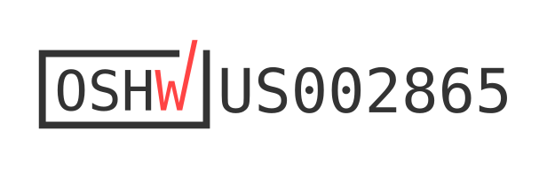

# RheoBoard

Maintained by [Charlie Vuong](https://charlie-vuong.com) (The Hybrid Atelier at UT Arlington).

RheoBoard is open hardware for pneumatic retraction-extrusion measurements. The DIY version uses
two air pumps, one valve, an ESP32 with BLE, and a Qwiic MicroPressure sensor. On command, it runs
a REP (retraction-extrusion pulse) and streams the pressure trace.

## Start here

1. [Step-by-step DIY build guide](BuildYourOwn/README.md)
2. [RheoBoard wiki](https://github.com/The-Hybrid-Atelier/RheoBoard/wiki)
3. [Custom PCB](RheoBoard_PCB/README.md)

The firmware in [`firmware/`](firmware/) and the RheoData notes in [`software/`](software/) apply
to the DIY build, the PCB, and the portable version.

The panel and enclosure are 3D printed (PLA); print files and notes are in
[`BuildYourOwn/cad/encloser/`](BuildYourOwn/cad/encloser/). There are no laser-cut parts.

## License

All license notices are consolidated in [`LICENSE`](LICENSE):

- Hardware designs: CERN-OHL-W-2.0
- Firmware: MIT
- Documentation: [CC BY-SA 4.0](https://creativecommons.org/licenses/by-sa/4.0/)

Third-party parts, photos, datasheets, and libraries remain under their original terms; sources
are listed in [`BuildYourOwn/images/README.md`](BuildYourOwn/images/README.md) and
[`BuildYourOwn/hardware/references/README.md`](BuildYourOwn/hardware/references/README.md).

RheoBoard version 1 is certified open source hardware by the Open Source Hardware Association,
UID [US002865](https://certification.oshwa.org/us002865.html) (certified 2026-10-08); its docs are
at the [`v1` tag](https://github.com/The-Hybrid-Atelier/RheoBoard/tree/v1). Version 2, the
3D-printed build on `main`, is not certified yet. See [`docs/certification.md`](docs/certification.md). Machine-readable project metadata and the current
version are in [`okh-RheoBoard.yml`](okh-RheoBoard.yml).

If you build or distribute a derived unit, do not imply that it is manufactured, sold, warranted,
or endorsed by the original designer.
