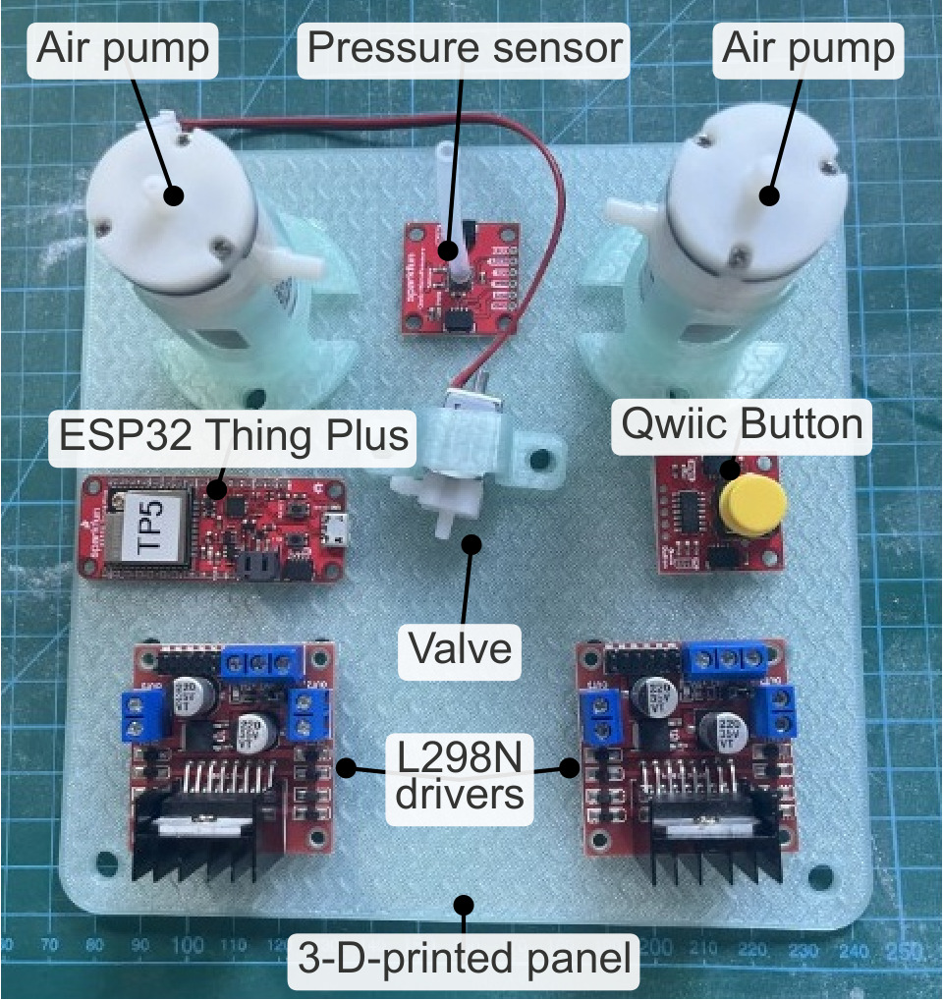
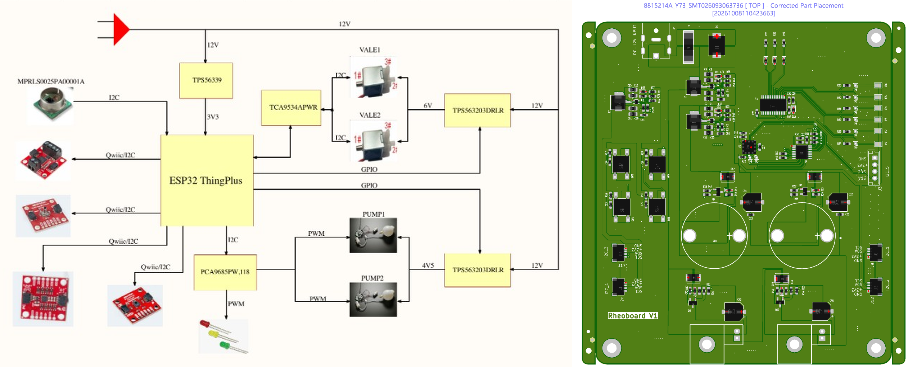
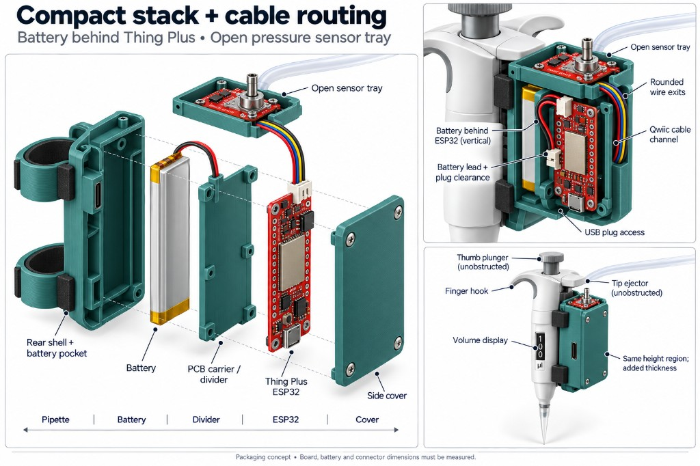

# Build options

A builder starts on the wiki at [Build options](https://github.com/The-Hybrid-Atelier/RheoBoard/wiki/Build-options). The RheoBoardOTS - DIY and RheoBoardPipette - Portable sections repeat those pages. The RheoBoard_v1 - PCB section shows the block diagram and the submitted Rheoboard V1 placement. The separate pages stay: [Main (DIY)](https://github.com/The-Hybrid-Atelier/RheoBoard/wiki/Main-(DIY)), [Main (PCB)](https://github.com/The-Hybrid-Atelier/RheoBoard/wiki/Main-(PCB)), and [Main (Portable)](https://github.com/The-Hybrid-Atelier/RheoBoard/wiki/Main-(Portable)). Board details are in [`RheoBoard_PCB/README.md`](../RheoBoard_PCB/README.md).

## RheoBoardOTS - DIY

Build version 2, the flat 3D-printed panel. It is in progress. Open items are marked TODO in the assembly instructions. There are no laser-cut parts. Version 1 is the archived laser-cut panel in the repository at [`BuildYourOwn/archive/laser-cut-v1/`](../BuildYourOwn/archive/laser-cut-v1/), not a wiki page. It is certified by OSHWA as US002865.

RheoBoardOTS - DIY uses two air pumps, one valve, an ESP32 with BLE, and a Qwiic MicroPressure sensor. On command, it runs a REP (retraction-extrusion pulse) and streams the pressure trace.

**Next:** [Parts to buy](https://github.com/The-Hybrid-Atelier/RheoBoard/wiki/Parts-to-buy). Those assembly steps are also in the [RheoBoardOTS - DIY build guide](../BuildYourOwn/README.md).

## RheoBoard_v1 - PCB

This is a separate KiCad 10 board: schematic, layout, libraries, Gerbers, assembly BOM, and pick-and-place. Everyday wall power is a 12 V plug. The board is a 1.6 mm, two-copper-layer layout. It is a prototype.

Left is the block diagram (12 V in, valves at 6 V, pumps at 4.5 V). Right is the submitted Rheoboard V1 placement, order 8815214A_Y73 / SMT026093063736.

**Next:** [BOM](https://github.com/The-Hybrid-Atelier/RheoBoard/wiki/BOM).

## RheoBoardPipette - Portable

The same firmware and RheoData notes apply. USB uploads firmware to the SparkFun ESP32 Thing Plus. After upload, USB may be disconnected. Portable power is a [SparkFun Lithium Ion Battery 1500 mAh, IEC62133 certified (PRT-26059)](https://www.sparkfun.com/lithium-ion-battery-1500mah-iec62133-certified.html): nominal 3.7 V, and it plugs into that board's JST battery connector (schematic V_BATT, 4.2 V maximum).

Packaging concept. Board, battery, and connector dimensions must be measured. There is no separate RheoBoardPipette - Portable enclosure in the repository.

The RheoBoardPipette - Portable 3D-printed parts are not in the repository yet, so this page is TODO. The packaging concept is not a print file.

**Next:** [Portable parts to buy](https://github.com/The-Hybrid-Atelier/RheoBoard/wiki/Portable-parts-to-buy).

License: CC BY-SA 4.0 — see [Certification](https://github.com/The-Hybrid-Atelier/RheoBoard/wiki/Certification).
