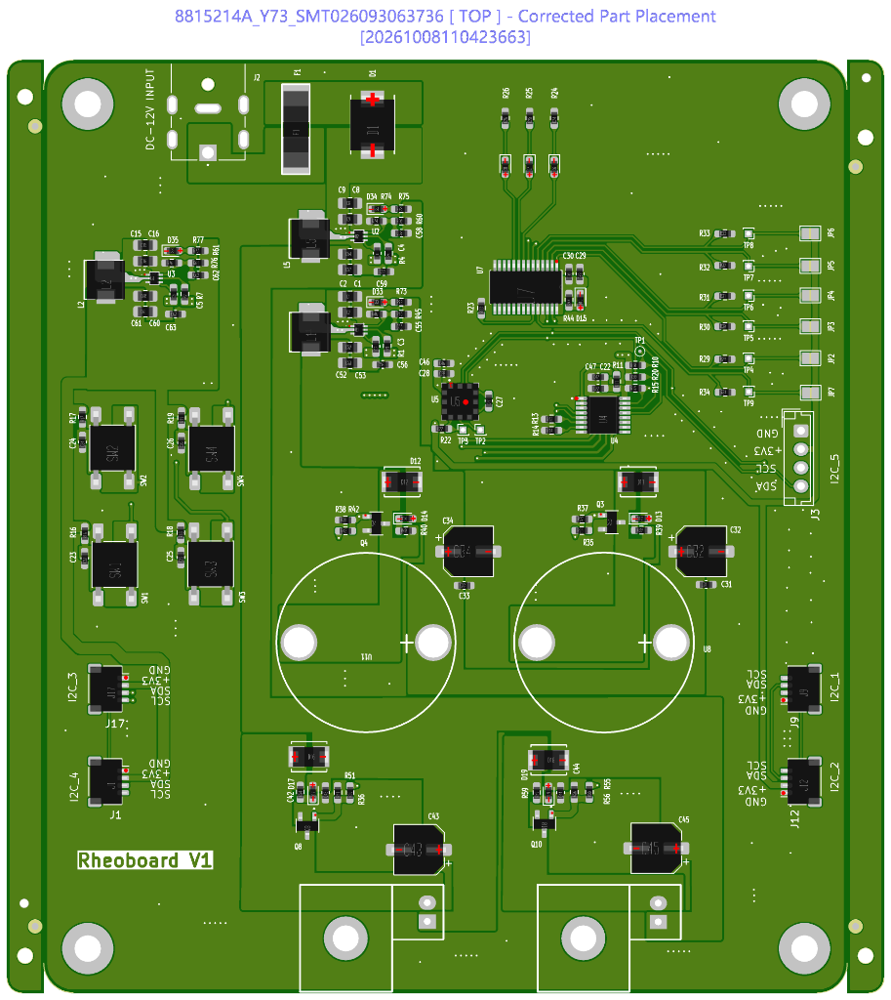

# Build options

License: CC BY-SA 4.0 — see [`../LICENSE`](../LICENSE).

A builder starts on the wiki at Build options and chooses one path: DIY, the custom PCB, or portable. Each path has its own steps on the wiki. Board details are in [`RheoBoard_PCB/README.md`](../RheoBoard_PCB/README.md).

## DIY

Build version 2 on `main` (3D-printed panel). It is in progress, and [Step 01](../BuildYourOwn/README.md#step-01-assemble-the-platform) of the build guide has TODOs. Version 1 is at the [`v1` tag](https://github.com/The-Hybrid-Atelier/RheoBoard/tree/v1).

The wiki DIY path is Parts to buy, then Parts to 3D print, then Assembly instructions. Those steps are also in the [DIY build guide](../BuildYourOwn/README.md).

The DIY version uses two air pumps, one valve, an ESP32 with BLE, and a Qwiic MicroPressure sensor. On command, it runs a REP (retraction-extrusion pulse) and streams the pressure trace.

Version 2 uses a 3D-printed panel ([print files and notes](../BuildYourOwn/cad/encloser/README.md)). There are no laser-cut parts. The version 1 laser-cut panel, certified by OSHWA as US002865, is archived in [`BuildYourOwn/archive/laser-cut-v1/`](../BuildYourOwn/archive/laser-cut-v1/).

## Custom PCB

[`RheoBoard_PCB/`](../RheoBoard_PCB/) is a separate KiCad 10 board: schematic, layout, libraries, Gerbers, assembly BOM, and pick-and-place. Everyday wall power for this board is a 12 V plug. Read [`RheoBoard_PCB/README.md`](../RheoBoard_PCB/README.md) before ordering boards.

JLCPCB's corrected top placement for the submitted Rheoboard V1 assembly. Order 8815214A_Y73, SMT job SMT026093063736.

Block diagram of that board. 12 V comes in at the top. The ESP32 Thing Plus sits in the center. The pressure sensor and Qwiic devices are on the left. The valve rail is 6 V and the pump rail is 4.5 V.

From that README: this is a separate board from the DIY module build in `BuildYourOwn/`. The firmware in [`code/firmware/`](../code/firmware/) and the RheoData notes in [`code/software/`](../code/software/) apply to the DIY build, this PCB, and the portable version. Open `RheoBoard_v1/RheoboardV1/RheoBoard_v1.kicad_pro` in KiCad 10. The v1.05 project is `RheoBoard_PCB/RheoBoard_v1.05/RheoboardV1/RheoBoard_v1.05.kicad_pro`. The board is a 1.6 mm, two-copper-layer layout. This board is a prototype. The block diagram is not a full v1.05 qualification.

The wiki PCB path is the bill of materials, then the KiCad design, then firmware and software. Current v1.05 purchasing files are in [`RheoBoard_PCB/RheoBoard_v1.05/BOM/`](../RheoBoard_PCB/RheoBoard_v1.05/BOM/). The original v1 workbook is [`BOM_RheoboardV1_JLCSMT.xlsx`](../RheoBoard_PCB/RheoBoard_v1.05/Archive_v1_outputs/BOM/BOM_RheoboardV1_JLCSMT.xlsx).

## Portable

The same firmware and RheoData notes apply. USB uploads firmware to the SparkFun ESP32 Thing Plus. After upload, USB may be disconnected. Portable power is a [SparkFun Lithium Ion Battery 1500 mAh, IEC62133 certified (PRT-26059)](https://www.sparkfun.com/lithium-ion-battery-1500mah-iec62133-certified.html): nominal 3.7 V, and it plugs into that board's JST battery connector (schematic V_BATT, 4.2 V maximum).

The wiki portable path buys the ESP32 Thing Plus, the Qwiic MicroPressure, and this battery, then prints the current-build panel, sensing tube, and small connector. There is no separate portable enclosure in the repository.
