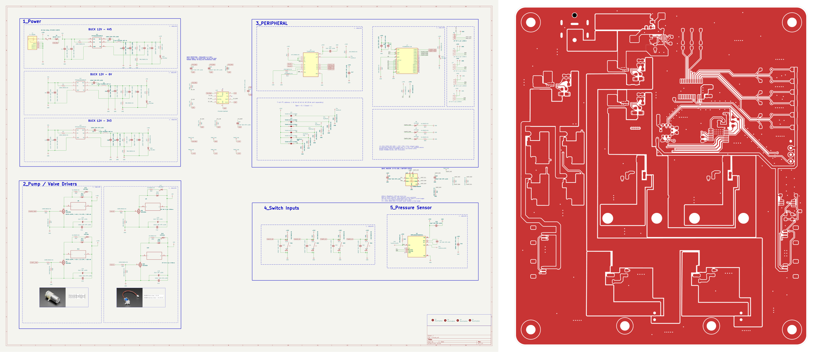

# Build options

License: CC BY-SA 4.0 — see [`../LICENSE`](../LICENSE).

A builder starts on the wiki at [Build options](https://github.com/The-Hybrid-Atelier/RheoBoard/wiki/Build-options) and chooses one path. That page is the chooser. Each choice has one next page, and that page shows one picture. Board details are in [`RheoBoard_PCB/README.md`](../RheoBoard_PCB/README.md).

## DIY

Build version 2 on `main` (3D-printed panel). It is in progress, and [Step 01](../BuildYourOwn/README.md#step-01-assemble-the-platform) of the build guide has TODOs. Version 1 is at the [`v1` tag](https://github.com/The-Hybrid-Atelier/RheoBoard/tree/v1).

The DIY version uses two air pumps, one valve, an ESP32 with BLE, and a Qwiic MicroPressure sensor. On command, it runs a REP (retraction-extrusion pulse) and streams the pressure trace. Version 2 uses a 3D-printed panel ([print files and notes](../BuildYourOwn/cad/encloser/README.md)). There are no laser-cut parts. The version 1 laser-cut panel, certified by OSHWA as US002865, is archived in [`BuildYourOwn/archive/laser-cut-v1/`](../BuildYourOwn/archive/laser-cut-v1/).

Wiki path: [DIY](https://github.com/The-Hybrid-Atelier/RheoBoard/wiki/DIY), then Parts to buy, Parts to 3D print, Assembly instructions, and [Code](https://github.com/The-Hybrid-Atelier/RheoBoard/wiki/Code). Those assembly steps are also in the [DIY build guide](../BuildYourOwn/README.md).

## Custom PCB

[`RheoBoard_PCB/`](../RheoBoard_PCB/) is a separate KiCad 10 board: schematic, layout, libraries, Gerbers, assembly BOM, and pick-and-place. Everyday wall power for this board is a 12 V plug. Read [`RheoBoard_PCB/README.md`](../RheoBoard_PCB/README.md) before ordering boards.

Left is the v1.05 schematic. Right is the v1.05 board.

From that README: this is a separate board from the DIY module build in `BuildYourOwn/`. The firmware in [`code/firmware/`](../code/firmware/) and the RheoData notes in [`code/software/`](../code/software/) apply to the DIY build, this PCB, and the portable version. Open `RheoBoard_v1/RheoboardV1/RheoBoard_v1.kicad_pro` in KiCad 10. The v1.05 project is `RheoBoard_PCB/RheoBoard_v1.05/RheoboardV1/RheoBoard_v1.05.kicad_pro`. The board is a 1.6 mm, two-copper-layer layout. This board is a prototype.

Wiki path: [PCB](https://github.com/The-Hybrid-Atelier/RheoBoard/wiki/PCB), then [BOM](https://github.com/The-Hybrid-Atelier/RheoBoard/wiki/BOM), PCB KiCad design, and [Code](https://github.com/The-Hybrid-Atelier/RheoBoard/wiki/Code). Current v1.05 purchasing files are in [`RheoBoard_PCB/RheoBoard_v1.05/BOM/`](../RheoBoard_PCB/RheoBoard_v1.05/BOM/). The original v1 workbook is [`BOM_RheoboardV1_JLCSMT.xlsx`](../RheoBoard_PCB/RheoBoard_v1.05/Archive_v1_outputs/BOM/BOM_RheoboardV1_JLCSMT.xlsx).

## Portable

The same firmware and RheoData notes apply. USB uploads firmware to the SparkFun ESP32 Thing Plus. After upload, USB may be disconnected. Portable power is a [SparkFun Lithium Ion Battery 1500 mAh, IEC62133 certified (PRT-26059)](https://www.sparkfun.com/lithium-ion-battery-1500mah-iec62133-certified.html): nominal 3.7 V, and it plugs into that board's JST battery connector (schematic V_BATT, 4.2 V maximum).

Packaging concept. Board, battery, and connector dimensions must be measured. There is no separate portable enclosure in the repository.

Wiki path: [Portable](https://github.com/The-Hybrid-Atelier/RheoBoard/wiki/Portable), then Portable parts to buy, Portable parts to 3D print, and [Code](https://github.com/The-Hybrid-Atelier/RheoBoard/wiki/Code).
