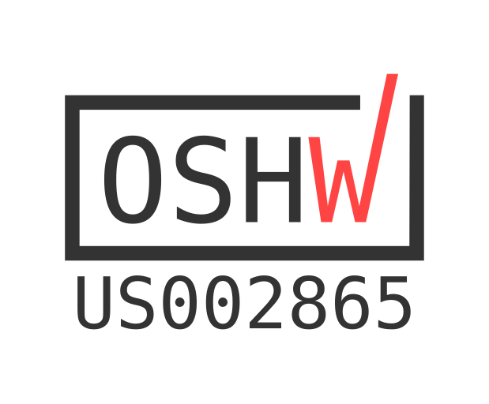
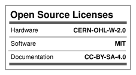

# Certification

RheoBoard is certified open source hardware by the
[Open Source Hardware Association](https://www.oshwa.org/) (OSHWA).

The current version is version 1. This is the same version certified by OSHWA as [US002865](https://certification.oshwa.org/us002865.html).

- UID: **US002865**
- Directory listing: https://certification.oshwa.org/us002865.html
- Licenses on file: CERN-OHL-W-2.0 (hardware), MIT (software), CC-BY-SA-4.0 (documentation)

## Mark files

- [`img/oshwa-certification-mark-US002865-stacked.svg`](img/oshwa-certification-mark-US002865-stacked.svg)
- [`img/oshwa-certification-mark-US002865-wide.svg`](img/oshwa-certification-mark-US002865-wide.svg)
- [`img/oshwa-license-facts.svg`](img/oshwa-license-facts.svg) — license label from the
  [OSHWA facts generator](https://oshwa.github.io/certification-mark-generator/facts)

The two mark files are OSHWA's templates from https://certification.oshwa.org with the UID filled
in, the same output as the SVG buttons on the directory page. The OSHW certification mark is a
trademark used under the OSHWA Certification Mark License Agreement, not under this repository's
licenses. Do not modify the mark. The mark is used on the GitHub repository and wiki only;
it is not printed on the PCB or the 3D-printed parts. Follow the
[usage guidelines](https://github.com/oshwa/certification-mark) when using it.

A derived or modified build is not covered by US002865 and should not carry this mark.

License: CC BY-SA 4.0 — see [`../LICENSE`](../LICENSE). This license does not cover the OSHWA certification mark files; see above.
