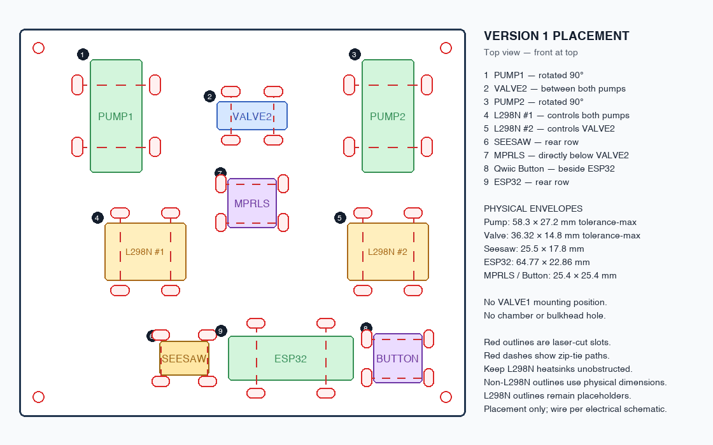

# Panel layout

License: CC BY-SA 4.0 — see [`../LICENSE`](../LICENSE).

Version 1 placement below is already stated in the [laser-cut panel notes](../BuildYourOwn/laser-cut/README.md) and in [Step 01 of the build guide](../BuildYourOwn/README.md#step-01-assemble-the-platform). Material, finished size, mounting, and physical envelopes are in the laser-cut panel notes.

From the laser-cut panel notes:

Both pumps are rotated 90° with VALVE2 centered between them. The two-pump L298N is on the left, the valve L298N is on the right, MPRLS is directly below VALVE2, and the seesaw, ESP32, and Button are behind the drivers. PWR, VALVE1, and the former chamber/bulkhead hole are removed.

From Step 01 of the build guide: zip-tie each component per the map above: PUMP1 and PUMP2 rotated 90° with VALVE2 centered between them; L298N #1 (both pumps) on the left; L298N #2 (VALVE2) on the right; MPRLS directly below VALVE2; and the ATtiny1616 seesaw, ESP32, and Button in the rear row, with the Button beside the ESP32. Version 1 has no PWR, VALVE1, or chamber mounting position.
