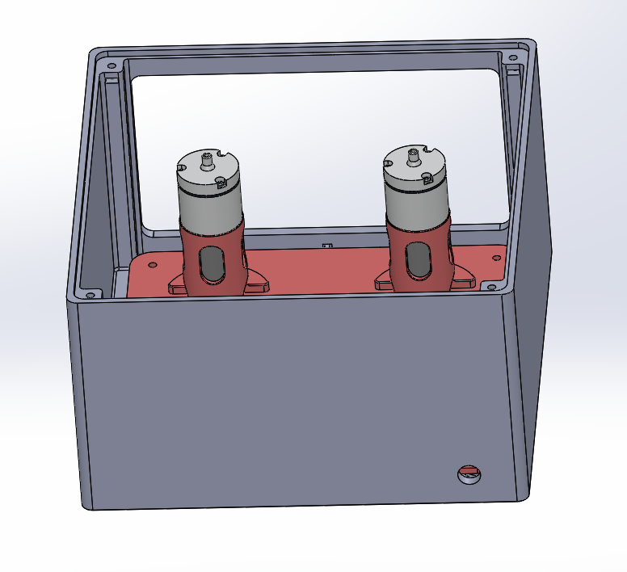

# Panel layout

License: CC BY-SA 4.0 — see [`../LICENSE`](../LICENSE).

Version 2 uses a 3D-printed panel inside a 3D-printed enclosure. The files and print notes are in
[`BuildYourOwn/cad/encloser/README.md`](../BuildYourOwn/cad/encloser/README.md), and assembly is
[Step 01 of the build guide](../BuildYourOwn/README.md#step-01-assemble-the-platform).

From the renders: the two pumps stand upright in printed holders, with the valve between them and
the L298N drivers behind the pumps.

TODO: placement of the MPRLS, seesaw, ESP32, and Button on the printed panel, and a placement
diagram. TODO: describe `encloser_pic3.jpg`.
