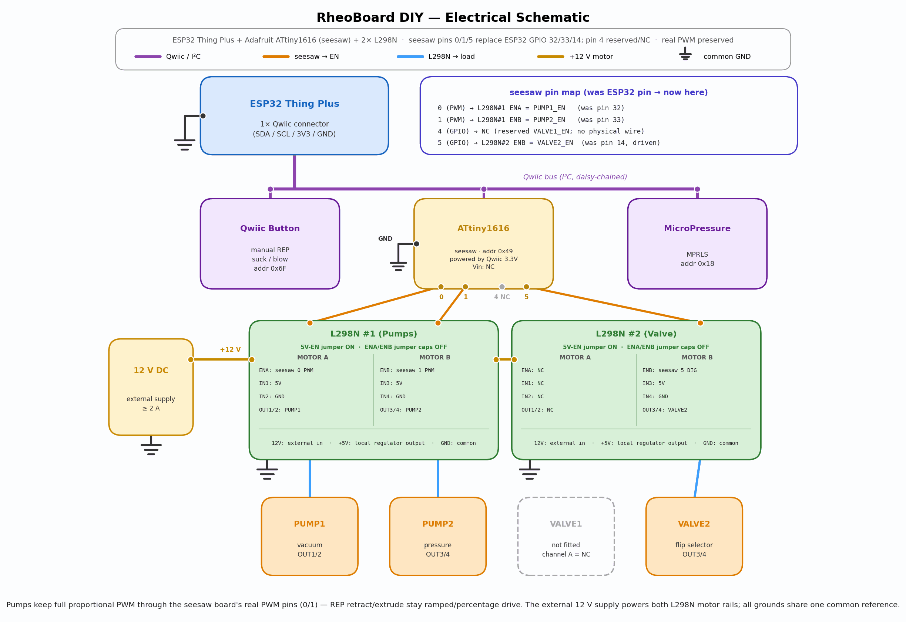
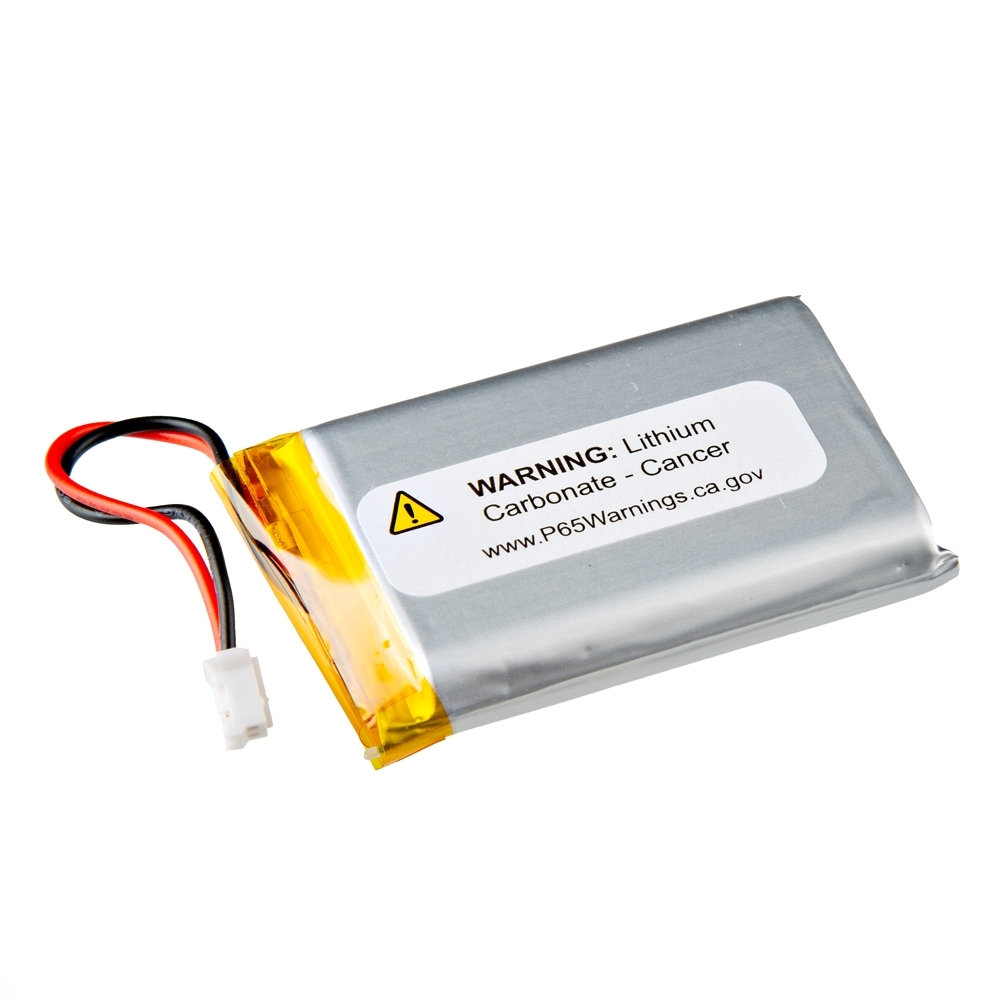

# Safety

License: CC BY-SA 4.0 — see [`../LICENSE`](../LICENSE).

Hazards below are the [Open Know-How health and safety notice](../okh-RheoBoard.yml) and the [build guide](../BuildYourOwn/README.md). The pump duty-cycle sentence is the one already in the [bill of materials](../BuildYourOwn/hardware/README.md). The pictures are the wiring diagram, the tube diagram, and the part photos already in the repository. Each caption says what to look at in that picture.

## 12 V adapter

From the health and safety notice: the build involves a mains-powered 12 V DC adapter. Risk: electric shock from mishandled mains wiring.

The bill of materials lists that adapter as the external supply for both L298N motor rails, ≥ 2 A recommended, sharing GND with the ESP32.

From the build guide:

- Leave micro-USB and the 12 V adapter disconnected while connecting electronics and tubing.
- Leave the 12 V adapter unplugged until the Step 04 ground and motor-power checks.
- Power the ESP32 via micro-USB for upload and for the Step 04 test. Never back-feed 12 V into it.
- After upload, USB may be disconnected.
- With the firmware at safe idle, plug in the 12 V adapter while watching for unexpected pump/valve movement, excessive current draw, or heat. Disconnect immediately if any appears.

Everyday wall power for the DIY build and for the PCB is that 12 V plug.

The orange **12 V DC** box is that adapter. Its line enters **L298N #1 (Pumps)** and **L298N #2 (Valve)**. The ESP32 box is drawn with a Qwiic connector and a ground symbol. The adapter stays unplugged until the Step 04 checks.

## Portable battery

Portable power for the SparkFun ESP32 Thing Plus is the [SparkFun Lithium Ion Battery 1500 mAh, IEC62133 certified (PRT-26059)](https://www.sparkfun.com/lithium-ion-battery-1500mah-iec62133-certified.html) plugged into its JST battery connector (nominal 3.7 V; vendored schematic V_BATT, 4.2 V maximum).

The first photo is that ESP32 board. Its 2-pin JST socket is the battery connector. The second photo is the PRT-26059 pack; its white 2-pin plug is the lead that mates with that socket. The 12 V adapter is the supply drawn into the L298N boards.

## Soldering

From the health and safety notice: the build involves soldered wiring. Risk: burns from soldering.

From the build guide: basic soldering is not required if the boards already have headers and the actuator leads are prepared. A soldering iron and solder are used only if headers or wire leads are not already fitted.

This photo is the generic L298N stand-in from the parts list. The blue screw terminals take prepared leads. The pin header is the part that is soldered when it is not already fitted.

## Pneumatic pressure

From the health and safety notice: the build involves generated pneumatic pressure/vacuum. Pressurized-air hazards: do not point tubing/nozzles at eyes; keep pressures modest.

The orange **CHAMBER / NOZZLE** box is the open end of the sensed line. PUMP1's end port and PUMP2's side port are drawn open to atmosphere. Keep the nozzle and those open ports away from eyes.

## ESP32 5 V pin

From the health and safety notice: never route pump/valve current through the ESP32's 5 V pin.

From the build guide: no pump or valve is powered from the ESP32.

On the wiring diagram above, each L298N box labels **+5 V** as that board's own regulator output, and labels **12 V** as the external motor input. Pump and valve current uses the 12 V terminal on the L298N boards. The ESP32 5 V pin stays out of that path.

## Pumps on the 12 V rail

From the health and safety notice: air pumps are ~4.5 V parts on a 12 V rail — limit duty cycle to avoid overheating.

From the bill of materials: pumps are rated ~4.5–5 V and the valve ~6 V. Adafruit's ~50% pump duty-cycle recommendation describes intermittent run time, not a 50% PWM ceiling; firmware may use brief higher-PWM pulses, but the pumps should not run continuously.

The silver can on the Adafruit 4699 is the motor rated about 4.5–5 V. The 12 V adapter still feeds the L298N that drives it, so these pumps stay intermittent. The second photo is the valve, rated about 6 V.
