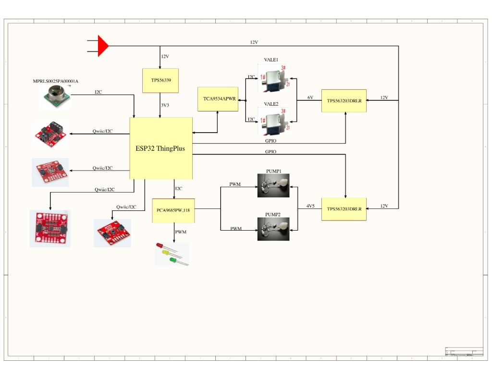

# Safety

License: CC BY-SA 4.0 — see [`../LICENSE`](../LICENSE).

Read this after the build. These hazards apply to the DIY panel, the custom PCB, and portable power.

## 12 V adapter

The DIY build, the custom PCB, and portable use all take everyday wall power from a mains-powered 12 V DC adapter. Risk: electric shock from mishandled mains wiring.

The adapter supplies the pumps and the valve. On the DIY panel it feeds both L298N motor rails, ≥ 2 A recommended, sharing ground with the ESP32. On the custom PCB it is the board's 12 V input. Portable power does not replace this plug. The battery powers the ESP32 only.

- Leave micro-USB and the 12 V adapter disconnected while connecting electronics and tubing.
- On the DIY panel, leave the adapter unplugged until the Step 04 ground and motor-power checks.
- On the PCB, leave 12 V unplugged until that board's power path has been checked.
- Power the ESP32 via micro-USB for upload and for the first power test. Do not feed 12 V into the ESP32.
- After upload, USB may be disconnected.
- With the firmware at safe idle, apply 12 V while watching for unexpected pump or valve movement, excessive current, or heat. Disconnect immediately if any appears.

On the DIY diagram, the orange **12 V DC** box is that adapter. Its line enters **L298N #1 (Pumps)** and **L298N #2 (Valve)**.

On the custom PCB, 12 V enters at the top and feeds the regulators. The valve rail is 6 V and the pump rail is 4.5 V.

## Portable battery

Portable power, on the DIY build and on the PCB, is the [SparkFun Lithium Ion Battery 1500 mAh, IEC62133 certified (PRT-26059)](https://www.sparkfun.com/lithium-ion-battery-1500mah-iec62133-certified.html) plugged into the ESP32 Thing Plus JST battery connector (nominal 3.7 V; schematic V_BATT, 4.2 V maximum).

The first photo is that ESP32 board. Its 2-pin JST socket is the battery connector. The second photo is the PRT-26059 pack; its white 2-pin plug mates with that socket. The pumps and the valve still use the 12 V adapter.

## Soldering

Risk: burns from soldering.

On the DIY panel, soldering is used only if headers or wire leads are not already fitted. The photo is the generic L298N stand-in. The blue screw terminals take prepared leads. The pin header is soldered when it is not already fitted.

On the PCB, the manually fitted connectors, headers, and pumps are the soldered parts. The same burn hazard applies while the iron is in use.

## Pneumatic pressure

The DIY panel, the PCB, and portable use generate pneumatic pressure and vacuum. Do not point tubing or nozzles at eyes. Keep pressures modest.

The orange **CHAMBER / NOZZLE** box is the open end of the sensed line. PUMP1's end port and PUMP2's side port are drawn open to atmosphere. Keep the nozzle and those open ports away from eyes on every version.

## ESP32 5 V pin

Pump and valve current does not go through the ESP32 5 V pin. This is the same rule for the DIY panel, the PCB, and portable use.

On the DIY diagram, each L298N box labels **+5 V** as that board's own regulator output, and **12 V** as the external motor input. On the PCB block diagram, the pump and valve rails come from the board regulators, not from the ESP32.

## Pumps and valve

The pumps are rated about 4.5–5 V and the valve about 6 V, on the DIY panel, the PCB, and portable use. Adafruit's about 50% pump duty-cycle recommendation describes intermittent run time, not a 50% PWM ceiling. Firmware may use brief higher-PWM pulses. The pumps should not run continuously.

The silver can on the Adafruit 4699 is that motor. On the DIY panel the 12 V adapter feeds the L298N that drives it. On the PCB the block diagram shows the pump rail at 4.5 V and the valve rail at 6 V, both fed from the 12 V input. The second photo is the valve.
